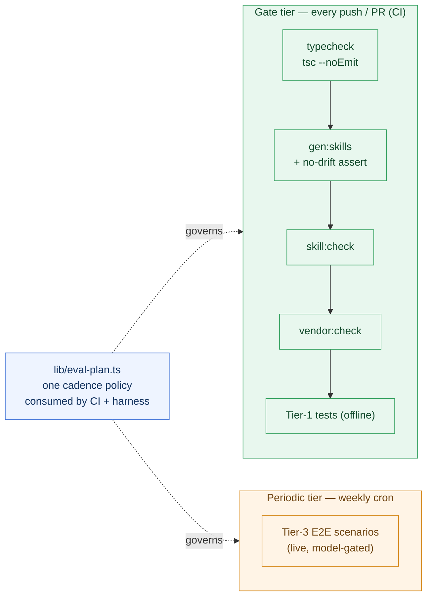
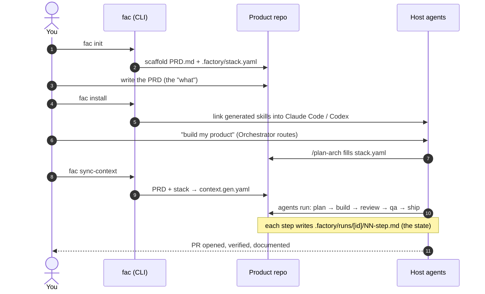

# Architecture — AI Software Factory

> **Read this if:** you're new to the codebase and want to know *what each folder is, what it does,
> and how the pieces connect* — including why skills use the odd `SKILL.md.tmpl` extension.
>
> Companion docs: [implementation-plan.md](implementation-plan.md) is the design record and history;
> [AGENTS.md](../AGENTS.md) is the short "load this first" memory for agents. This file is the map.

---

## 1. What the tool is, in one paragraph

The **AI Software Factory** (CLI codename `fac`) is a *product-agnostic AI engineering workflow*.
You give it a product idea written as a **PRD** (Product Requirements Document), and a team of
specialist AI agents — strategist, architect, designer, implementer, reviewer, QA, security,
release — turn it into shipped software. Each agent is powered by a **workflow skill** (the *method*:
"how a code review is done"). Those skills stay consistent because they are **generated** from
templates, and they get their *values* (your tech stack, guardrails, commands) from **your PRD**, not
from hard-coded assumptions. The whole thing is modelled on gstack's orchestration and assembled
from a library of reusable "craft" skills called `agent-skills`.

The single most important idea: **method and values are separated.** The skill says *how*; the PRD
says *what*. That separation is what makes one workflow work for any product.

---

## 2. The three-layer model

Everything in the repo belongs to one of three layers. This is the mental model to hold onto.

```mermaid
flowchart TB
    subgraph L1["LAYER 1 · Workflow skills — the 'how' (we build these)"]
        direction LR
        L1a["/plan-arch · /review · /qa · /ship · /investigate ...<br/>generated from SKILL.md.tmpl templates"]
    end

    subgraph L2["LAYER 2 · Craft skills — reusable expertise (we vendor these)"]
        direction LR
        L2a["python-expert · fullstack-developer · code-reviewer<br/>ux-designer · tdd-red-green-refactor · technical-writer ...<br/>copied + pinned from the agent-skills library"]
    end

    subgraph L3["LAYER 3 · Tooling — the hands (we build/adopt these)"]
        direction LR
        L3a["browse · design · make-pdf · diagram<br/>generator · eval harness · memory/decision store · redaction guard"]
    end

    PRD["PRD.md + .factory/stack.yaml<br/>(your product's values)"]

    L1 --> L2 --> L3
    PRD -. "bound at runtime via &#36;&#123;ctx.*&#125;" .-> L1
    PRD -.-> L2

    classDef layer fill:#eef4ff,stroke:#3b6fd6,stroke-width:1px,color:#12325e;
    classDef ctx fill:#fff4e6,stroke:#d68a1e,stroke-width:1px,color:#6e4310;
    class L1,L2,L3 layer;
    class PRD ctx;
```



| Layer | What it is | Where it lives | Who authors it |
|---|---|---|---|
| **1 — Workflow skills** | The *procedures* agents follow (plan, review, QA, ship...). The gstack "shell." | `skills/` | We write them (as templates) |
| **2 — Craft skills** | Reusable domain/craft expertise (how to write Python, review code, design UX). | `vendor-skills/` | Vendored (copied + pinned) from `agent-skills` |
| **3 — Tooling** | The binaries and harness the skills *call* — browser, diagram/PDF/image generators, the skill generator, the eval harness, stores. | `tools/`, `scripts/`, `lib/` | We build/adopt them |

---

## 3. Repository map — what each folder is

```
ai-software-factory/
├── bin/fac.ts              ← the CLI dispatcher. Every `fac <cmd>` routes from here.
├── skills/                 ← LAYER 1. One folder per workflow skill. Contains SKILL.md.tmpl (source)
│                             and the generated SKILL.md (output). Never hand-edit the .md.
├── vendor-skills/          ← LAYER 2. Craft skills copied from agent-skills, pinned by version+sha256
│                             in manifest.json. Never edit in place — fix upstream and re-vendor.
├── tools/                  ← LAYER 3 binaries, each a self-contained CLI:
│   ├── browse/               headless browser (for /qa + design review)
│   ├── design/               UI mockup / image generation (for /plan-design)
│   ├── make-pdf/             Markdown → publication-quality HTML/PDF (for /document)
│   └── diagram/              validate + render Mermaid diagrams (for /plan-arch)
├── scripts/                ← the implementation behind each `fac` subcommand (thin CLI wrappers)
│   ├── gen-skill-docs.ts     the GENERATOR: SKILL.md.tmpl → SKILL.md (see §4)
│   ├── skill-check.ts        static validation of skills (drift, frontmatter, line budget)
│   ├── vendor.ts             copy + pin a craft skill from agent-skills
│   ├── vendor-check.ts       verify vendored skills' integrity + ${ctx.*} bindings resolve
│   ├── sync-context.ts       merge PRD.md + stack.yaml → context.gen.yaml (see §5)
│   ├── host-config.ts        the HostConfig contract + frontmatter transform per host
│   ├── resolvers/            functions that fill {{TOKENS}} in templates (preamble, ethos, config)
│   ├── install.ts            link/copy generated skills into detected host CLIs
│   ├── eval-select.ts        pick which E2E scenarios run for a given diff/tier
│   ├── benchmark-models.ts   compare a skill's output across several models
│   └── memory/decision/context/redact/guard/run.ts   the cross-cutting subsystems (see §7)
├── lib/                    ← shared, importable, unit-tested PURE cores (no side effects at import):
│   ├── yaml.ts               parse (Bun) + deterministic block-style serialize
│   ├── frontmatter.ts        the single frontmatter parser/renderer
│   ├── schema.ts             Ajv validation against project-context.schema.json
│   ├── context.ts            load / ownership-check / merge / derive the two product halves
│   ├── eval-plan.ts          the eval-cadence policy (gate vs periodic) — one source of truth
│   ├── install-plan.ts       the pure install planner (what links where, per platform)
│   └── memory/decision/redact/guard/run/benchmark-models/eval-select.ts   pure cores for §7
├── hosts/                  ← multi-host adapters (claude.ts, codex.ts). Adding a host = one file.
├── templates/              ← PRD.template.md + stack.template.yaml — what `fac init` copies.
├── test/                   ← the eval harness (Tier 1 static, Tier 2 LLM-judge, Tier 3 E2E).
├── examples/reference-product/   ← the GOLDEN fixture the pipeline runs against.
├── project-context.schema.json   ← the contract for the merged runtime context (x-owner per key).
├── .factory/               ← (created inside a PRODUCT repo by `fac init`)
│   ├── stack.yaml            machine-owned design record (COMMITTED)
│   ├── context.gen.yaml      derived by sync-context (git-ignored)
│   └── runs/<id>/            per-run artifact handoffs between agents (git-ignored)
└── setup                   ← one-time install: build + delegate to scripts/install.ts
```

The **`lib/` vs `scripts/` split** is deliberate and worth internalising: `lib/` holds *pure logic*
(testable offline, no I/O at import), `scripts/` holds the *thin CLI shell* around it (argument
parsing, file writes, `process.exit`). This is why the test suite can run fully offline — it imports
the `lib/` cores directly and never shells out.

---

## 4. Why `SKILL.md.tmpl`? The generation pipeline

**The short answer:** workflow skills are *generated*, not hand-written, so every skill shares the
exact same ethos, writing-style, and config-protocol preamble — and stays that way forever. The
`.tmpl` file is the **source you edit**; the `.md` file is a **build artifact you never touch**.

If you edited `SKILL.md` directly, the shared preamble would drift skill-by-skill and each author
would reinvent tone and structure. Instead, a template declares only what's *unique* to that skill,
and the generator injects the shared parts and writes one output per host.

```mermaid
flowchart LR
    T["skills/&lt;name&gt;/<br/><b>SKILL.md.tmpl</b><br/>(source of truth — you edit this)"]
    R["scripts/resolvers/*<br/>fill &#123;&#123;TOKENS&#125;&#125;<br/>PREAMBLE · ETHOS · CONFIG_PROTOCOL"]
    G["scripts/gen-skill-docs.ts<br/><b>renderSkill()</b> — a PURE function"]
    H["hosts/index.ts<br/>(claude, codex)"]

    C["skills/&lt;name&gt;/<br/><b>SKILL.md</b><br/>(canonical output)"]
    X[".codex/skills/&lt;name&gt;/<br/><b>SKILL.md</b> (+ metadata)<br/>(per-host output)"]

    T --> G
    R --> G
    H --> G
    G --> C
    G --> X

    CHK["scripts/skill-check.ts<br/>re-runs renderSkill() and<br/>byte-compares → fails on drift"]
    C -. verified by .-> CHK
    G -. same pure fn .-> CHK

    classDef src fill:#e8f7ee,stroke:#2f9e5b,color:#12492b;
    classDef gen fill:#eef4ff,stroke:#3b6fd6,color:#12325e;
    classDef out fill:#f4f0ff,stroke:#7a5bd6,color:#33215e;
    classDef chk fill:#fff4e6,stroke:#d68a1e,color:#6e4310;
    class T,R src;
    class G,H gen;
    class C,X out;
    class CHK chk;
```



How it works, concretely (see [scripts/gen-skill-docs.ts](../scripts/gen-skill-docs.ts)):

1. The generator finds every `skills/*/SKILL.md.tmpl`.
2. It parses the template's frontmatter and asserts `name` == folder name (a guardrail).
3. It replaces `{{TOKENS}}` in the body via the resolvers — `{{PREAMBLE}}` injects the shared
   ethos + writing-style + config-protocol block ([scripts/resolvers/index.ts](../scripts/resolvers/index.ts)).
4. For each host in `hosts/`, it applies that host's frontmatter transform and writes the output —
   the *canonical* `skills/<name>/SKILL.md` plus per-host copies (e.g. `.codex/…`).

**Drift is impossible to miss:** `renderSkill()` is a pure function, and `skill-check.ts` re-runs it
and does a **byte-exact comparison** against the committed `SKILL.md`. If you edit a `.md` by hand or
forget to regenerate after editing a `.tmpl`, CI fails. So the rule is simple:

> Edit the `.tmpl`, run `bun run gen:skills`, commit **both** files.

---

## 5. How values reach the skills — the context binding

A skill template references values as `${ctx.something}` (e.g. `${ctx.commands.test}`). Those come
from **your product**, which is defined by **two files with two different owners**:

| File | Owner | Holds |
|---|---|---|
| `PRD.md` | **human** | frontmatter (`product`, `domain`, `meta`) + the body: the requirements |
| `.factory/stack.yaml` | **`/plan-arch` agent** | `tech_stack`, `commands`, `skills`, `guardrails`, `escalation_policy` |

They were once one file. Splitting them stops an agent (writing `tech_stack`) from clobbering a file
a human is editing, and lets the two halves change at their own cadence. **Both are committed** —
`stack.yaml` is a design record, not a throwaway build artifact.

`fac sync-context` merges the two halves into a single git-ignored `.factory/context.gen.yaml`,
validates it against `project-context.schema.json`, and *that* is what the skills read at runtime.
Two keys are **derived, never authored**: `project` (an alias of `product`) and `tech_bindings`
(computed from `tech_stack.components[]`). `sync-context` refuses to merge on an ownership violation
rather than silently doing the wrong thing.

```mermaid
flowchart LR
    PRD["<b>PRD.md</b><br/>human-owned<br/>product · domain · requirements"]
    STK["<b>.factory/stack.yaml</b><br/>machine-owned (/plan-arch)<br/>tech_stack · commands · guardrails"]
    SYNC["fac sync-context<br/>(lib/context.ts)"]
    SCHEMA["project-context.schema.json<br/>Ajv validation · x-owner per key"]
    GEN["<b>.factory/context.gen.yaml</b><br/>(git-ignored, derived)<br/>+ project + tech_bindings"]
    SKILLS["Workflow skills resolve<br/>&#36;{ctx.*} at runtime"]

    PRD --> SYNC
    STK --> SYNC
    SCHEMA -. validates .-> SYNC
    SYNC --> GEN --> SKILLS

    classDef human fill:#e8f7ee,stroke:#2f9e5b,color:#12492b;
    classDef machine fill:#eef4ff,stroke:#3b6fd6,color:#12325e;
    classDef derived fill:#f4f0ff,stroke:#7a5bd6,color:#33215e;
    class PRD human;
    class STK,SYNC,SCHEMA machine;
    class GEN,SKILLS derived;
```



**Config protocol** every skill honours: read the merged context → if a needed value is missing,
ask the user once → persist the answer to *the file that owns that key* → re-run `sync-context`.
Never ask twice.

---

## 6. How components connect — the system view

This is the "everything at once" picture. The left is the **Factory repo** (authoring time); the
right is **your product repo** (run time); the host CLI (Claude Code / Codex) is where agents
actually execute.

```mermaid
flowchart TB
    User(["You"])

    subgraph FAC["Factory repo (this codebase)"]
        direction TB
        CLI["bin/fac.ts<br/>CLI dispatcher"]
        subgraph BUILD["Authoring / build time"]
            direction LR
            TMPL["skills/*.tmpl"] --> GENSK["gen-skill-docs"] --> SKMD["skills/*/SKILL.md"]
            VEND["vendor.ts"] --> VS["vendor-skills/<br>(pinned)"]
        end
        LIBS["lib/ · pure cores<br/>yaml · frontmatter · schema · context<br/>eval-plan · install-plan · run · redact ..."]
        TOOLS["tools/<br/>browse · design · make-pdf · diagram"]
        HARNESS["test/ eval harness<br/>Tier1 static · Tier2 judge · Tier3 E2E"]
    end

    subgraph HOST["Host CLI (Claude Code / Codex)"]
        direction TB
        AGENTS["Specialist agents<br/>strategist → architect → designer →<br/>implementer → reviewer → QA → security → release"]
    end

    subgraph PROD["Your product repo"]
        direction TB
        PRD2["PRD.md + .factory/stack.yaml"]
        CTX2[".factory/context.gen.yaml<br/>(derived)"]
        RUNS[".factory/runs/&lt;id&gt;/<br/>artifact handoffs = the state"]
        CODE["shipped code + PR"]
    end

    User -->|"fac init"| PROD
    User -->|"fac install"| HOST
    CLI --> BUILD
    CLI --> LIBS
    CLI --> TOOLS
    CLI --> HARNESS

    SKMD -->|"fac install links them in"| AGENTS
    VS -.->|"agents load craft skills"| AGENTS
    PRD2 -->|"fac sync-context"| CTX2
    CTX2 -.->|"&#36;{ctx.*} values"| AGENTS
    AGENTS -->|"call"| TOOLS
    AGENTS -->|"write step artifacts"| RUNS
    RUNS --> CODE

    classDef u fill:#ffe9ec,stroke:#d6435b,color:#5e1220;
    classDef fac fill:#eef4ff,stroke:#3b6fd6,color:#12325e;
    classDef host fill:#e8f7ee,stroke:#2f9e5b,color:#12492b;
    classDef prod fill:#fff4e6,stroke:#d68a1e,color:#6e4310;
    class User u;
    class CLI,BUILD,LIBS,TOOLS,HARNESS,TMPL,GENSK,SKMD,VEND,VS fac;
    class AGENTS host;
    class PRD2,CTX2,RUNS,CODE prod;
```



---

## 7. Cross-cutting subsystems (`fac <cmd>`)

Each of these is a pure core in `lib/` with a thin CLI in `scripts/`, dispatched by `bin/fac.ts`:

| Command | What it does |
|---|---|
| `fac memory` | Scoped note store (product / session), secret-blocking on write. |
| `fac decision` | Append-only `decisions.jsonl` event log (log / list / supersede / redact / compact). |
| `fac context` | Save / restore working-context checkpoints across sessions. |
| `fac redact` | Screen outbound text for secrets/PII before it leaves the machine (a guardrail, not a vault). |
| `fac guard` | Check a proposed command/edit against the safety guardrails (destructive-op / freeze). |
| `fac run` | Manage a pipeline run — `new / status / artifact / resume / stop / list`. |

**The run contract** is the backbone of unattended execution: **artifacts *are* the state.** A step
completed iff its artifact file exists. Every artifact is written to `<name>.tmp` and atomically
renamed, so a half-written file can never look done. Resume re-runs *the first step that is missing
or stale* (an input hash no longer matches), giving make-like correctness even when a late failure's
true cause is an earlier step.

---

## 8. Quality gates — how we keep it honest



- **Static type-check** (`tsc --noEmit`) runs first — `strict` is on and it gates the build + CI.
- **No-drift assert** guarantees committed `SKILL.md` files match what the generator produces.
- **`skill:check`** validates frontmatter, a ≤500-line budget, and byte-exact drift.
- **`vendor:check`** verifies each vendored skill's hash and that every `${ctx.*}` it references is
  declared in the schema and populated by the golden reference product.
- **Eval tiers** — a fast **gate** on every PR, a heavier **periodic** tier weekly. The cadence lives
  in one place ([lib/eval-plan.ts](../lib/eval-plan.ts)) so CI and the harness can't disagree.

---

## 9. How you actually use it — the journey



Typical first-time sequence:

```bash
fac init                 # scaffold PRD.md + .factory/stack.yaml in a product repo
# ...write PRD.md...
fac install              # link the skills into your host CLI (Claude Code / Codex)
# ...ask the host to build; /plan-arch writes stack.yaml...
fac sync-context         # merge PRD + stack into the runtime context
# ...agents run the pipeline, writing artifacts to .factory/runs/<id>/...
```

And when you're working *on the Factory itself*:

```bash
bun run gen:skills       # regenerate SKILL.md from every .tmpl
bun run build            # typecheck + gen + skill:check + vendor:check
bun test                 # the offline test suite
```

---

## 10. The one-minute recap

- **Three layers:** workflow skills (how) → craft skills (expertise) → tooling (hands).
- **`.tmpl` is the source; `.md` is generated** — so every skill shares one ethos and never drifts.
- **PRD says *what*, skills say *how*** — bound at runtime through `context.gen.yaml` via `${ctx.*}`.
- **`lib/` is pure logic, `scripts/` is the CLI shell** — which is why tests run offline.
- **Artifacts are the state** — a run's progress is the set of files under `.factory/runs/<id>/`.
- **Gates keep it honest** — typecheck, no-drift, skill/vendor checks, and tiered evals.
