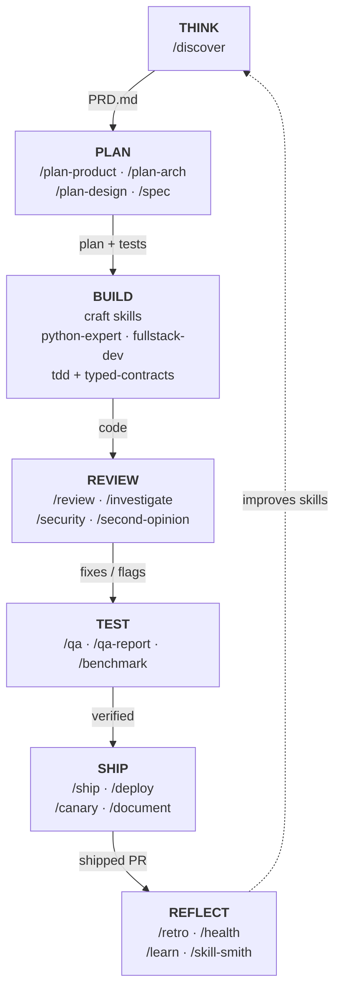

# AI Software Factory — Implementation Plan

> A gstack-class AI engineering workflow, built on the curated `agent-skills` library.
> Turn one builder + AI into a full virtual engineering team that plans, builds, reviews,
> tests, and ships your products end to end.

*Status: draft v0.6 · Last updated: 2026-07-22*

---

## Decisions (resolved 2026-07-21 → 2026-07-22)

These decisions are now locked and are reflected throughout the plan:

1. **Multi-language, decided at design time.** Products may be written in **Java, Quarkus,
   JavaScript, React, SQL, TypeScript, and Python**. The language is **not** fixed globally — it is
   chosen *per component* during the design phase (`/plan-arch`) and recorded in the product's
   **`.factory/stack.yaml`** (`tech_stack.components[]`). The Implementer agent then loads the craft
   skill matching that component's language.
   **Revised 2026-07-22 (sequencing, not scope):** language *routing* is designed in from day one,
   but Phase 1 proves the loop on **one** language path (TypeScript/React) before the second lands.
   Authoring four new craft skills alongside the first working pipeline was the single largest
   risk in the v0.3 schedule. `java-quarkus-expert` moves to Phase 1b; the three frontend craft
   skills move to Phase 2, where the design workflow that consumes them actually exists.
2. **Two hosts from day one: Claude Code + Codex.** Host adapters for both ship in **Phase 1**, not
   deferred. Skills stay host-agnostic; each host is a config adapter under `hosts/`.
   *Caveat (§5):* this holds for the **skills** layer. `agents/` are Claude-Code subagents and have
   no Codex equivalent — on Codex the Factory degrades to skills-only, with the Orchestrator's
   routing done inline rather than by spawning isolated sub-agents.
3. **Browser security is staged against exposure, not shipped whole in v1.** We adopt gstack's
   6-layer design in full, but build it in the order the threat actually arrives. **L1–L3 + L5**
   (datamarking, hidden-element stripping, blocklist, canary — all cheap string operations) ship
   with `browse` in Phase 1. **L4/L4b/L6** (ONNX classifier, transcript judge, ensemble verdict)
   are the largest Layer-3 item in the plan and defend against untrusted *external* page content;
   they are gated on `browse` being pointed at a page the operator did not author. Until then the
   tool reads localhost. See §6.1.
4. **Product-agnostic Factory; product context is split by author.** The Factory builds *any*
   product — it is not tied to one. Each product repo carries **two** files:
   - **`PRD.md`** — human-owned. Frontmatter holds product identity (`product`, `domain`, `meta`);
     the markdown body holds the requirements.
   - **`.factory/stack.yaml`** — machine-owned, written by `/plan-arch`: `tech_stack`, `commands`,
     `skills` manifest, `guardrails`, `escalation_policy`, `tech_bindings`.

   **Revised 2026-07-22.** v0.3 put both halves in PRD.md frontmatter. That made agents write back
   into the same file a human edits (a clobber hazard), and fused two things with completely
   different change cadences. Splitting by *author* keeps one human file and one machine file with
   no write contention. `fac sync-context` merges them into the derived `.factory/context.gen.yaml`
   that vendored skills bind to (see §3.4).

---

## 0. TL;DR

We are building **an AI software factory** — call it **Factory** (CLI codename `fac`, placeholder)

Three layers to build:

1. **Workflow skills** (the gstack layer we lack) — slash-command "specialists" that run a sprint:
   Think → Plan → Build → Review → Test → Ship → Reflect.
2. **Craft skills** (we already have these) — the implementation/design/planning skills, reused as-is.
3. **Tooling binaries** — a fast headless browser, doc/diagram/PDF generators, and the generation +
   eval harness that keeps skills honest.

Target: a working end-to-end loop (`/office-hours` → plan → build → `/review` → `/qa` → `/ship`)
on **Phase 1**, then hardening (evals, multi-host, security) in later phases.

---

## 1. What we're building and why

**Goal.** A repeatable, opinionated workflow that lets you ship products with AI. Every change gets team-grade planning, code review, QA, security, and release discipline — without you hand-writing the process each time.

**Non-goals (for now).**
- Not a resident/end-user product. This is *internal tooling* for you the builder.
- Not a rewrite of your `agent-skills` library. We *consume* it; we don't fork it.
- Not multi-tenant SaaS. Single-operator first; multi-host portability later.

**Definition of done for v1.** From a one-line product idea you can run a single chain of slash
commands that produces a reviewed, tested PR — with the actual implementation done by your craft
skills, not an unguided model.

---

## 2. Design principles 

1. **Skills are generated from templates.** A shared preamble (ethos, writing style, config
   protocol) is injected into every workflow skill at build time — one source of truth, no drift.
2. **Boil the ocean.** Completeness is cheap with AI. Prefer the complete implementation over the
   90% shortcut. Tests are the cheapest lake to boil.
3. **Search before building.** Check for a built-in / existing skill before writing new code.
4. **User sovereignty.** Models recommend; you decide. High-stakes steps ask, they don't assume.
5. **Platform-agnostic.** Skills never hardcode project commands. They **read `AGENTS.md`/config →
   ask if missing → persist the answer** so we never ask twice.
6. **The sprint is a pipeline.** Each skill writes an artifact the next one reads (design doc →
   plan → test plan → review → ship). Nothing falls through the cracks.
7. **Everything is measured.** A multi-tier eval harness proves skills work before they ship.
8. **Mechanism vs parameters.** A skill encodes the reusable *method*; `project-context.yaml`
   supplies the *values*. Never fork a skill to make it project-aware — parameterise it.
9. **Authoring standard.** Kebab-case folder == `name`; `SKILL.md` ≤ ~500 lines; deep material in
   `references/`; a mandatory **"Do not activate"** block; frontmatter with explicit triggers +
   ownership boundary.
10. **Freedom level.** Fragile/compliance steps are *low freedom* (strict procedures); creative
    steps are *high freedom* (principles).

### The delta to close
| Capability | Library today | Needed for Factory |
|---|---|---|
| Generation pipeline (template → SKILL.md + shared preamble) | ❌ static markdown | ✅ build |
| Ethos/writing-style injection | ❌ | ✅ build (resolver) |
| Eval harness (static + LLM-judge + E2E) | ❌ | ✅ build (Tier 0/1/2/3 all built 2026-07-22; diff-based selection + gate/periodic tiers) |
| Tooling binaries (browser, docs, diagram) | ❌ | ✅ build/adopt (✅ COMPLETE 2026-07-22 — browse + diagram + make-pdf + design all built) |
| Multi-host adapters (Claude, Codex, Cursor…) | partial (spec-compatible) | ✅ build |
| Runtime memory / decision store | design-only (`memory-systems`) | ✅ build runtime |
| Version + CHANGELOG discipline | per-skill semver | ✅ add repo-level |
| Safety skills (careful/freeze/guard) | ❌ | ✅ build (built 2026-07-22 — mechanical `lib/guard.ts` classifier + `fac guard`) |
| Redaction / secret guard | ❌ | ✅ build |

---

## 3. Target architecture

### 3.1 The lifecycle pipeline


```

Every arrow is an **artifact handoff** — a markdown doc or JSON in `.factory/runs/<id>/` (PRD.md,
plan + tests, code, review/security findings, QA report, the shipped PR, retro learnings). A skill
never re-derives what the previous one already decided; the dashed loop feeds REFLECT's learnings
back into the next THINK.

### 3.2 Three layers

```
┌──────────────────────────────────────────────────────────────────────┐
│  LAYER 1 — WORKFLOW SKILLS  (build new; the gstack shell)            │
│  /discover /plan-* /spec /review /investigate /security /qa /ship    │
│  /deploy /canary /benchmark /retro /health /learn /careful /freeze   │
├──────────────────────────────────────────────────────────────────────┤
│  LAYER 2 — CRAFT + DOMAIN SKILLS  (reuse from agent-skills)          │
│  python-expert  fullstack-developer  tdd-red-green-refactor          │
│  typed-service-contracts  ux-designer  visualization-expert          │
│  project-planner  sprint-planner  strategy-advisor  technical-writer │
│  memory-systems  multi-agent-patterns  self-improving-agent-skills   │
│  agent-discovery  quality-governance  (+ domain knowledge skills)    │
├──────────────────────────────────────────────────────────────────────┤
│  LAYER 3 — TOOLING BINARIES + HARNESS  (build/adopt)                 │
│  browse (headless browser)  design  make-pdf  diagram                │
│  gen-skill-docs (generator)  eval harness  host adapters             │
│  memory/decision store  redaction guard  ✅ built (Phase 3 Track 1)  │
└──────────────────────────────────────────────────────────────────────┘
        ▲ all bound at runtime by  PRD.md  (frontmatter → derived .factory/context.gen.yaml)
```

### 3.3 Skill generation pipeline (the gstack mechanism we adopt)

Workflow skills are **generated**, not hand-edited, so the shared ethos/preamble stays consistent:

```
skills/<name>/SKILL.md.tmpl   ──┐
scripts/resolvers/preamble.ts  ─┼─►  scripts/gen-skill-docs.ts  ──►  skills/<name>/SKILL.md
scripts/resolvers/ethos.ts     ─┤                                    (generated, committed)
scripts/resolvers/config.ts    ─┘
```

- `preamble.ts` injects: ethos summary, writing style, the **read-config→ask→persist** protocol,
  and the AskUserQuestion conventions.
- `ethos.ts` renders the "Boil the Ocean / Search First / User Sovereignty" block.
- Run `fac gen:skills` (or `bun run gen:skill-docs`) after editing any `.tmpl`.
- **Craft skills from your library are NOT generated** — they're vendored as-is and stay
  byte-identical to the source library (mechanism-vs-parameters rule).

### 3.4 Product definition binding — `PRD.md` + `.factory/stack.yaml`

The Factory is **product-agnostic**: `fac init` copies a template pair into any product repo. The
two files are split by **who writes them**, which is the only split that avoids write contention:

| File | Owner | Contents | Cadence |
|---|---|---|---|
| `PRD.md` | **human** | frontmatter: `product`, `domain`, `meta` · body: the requirements | rarely |
| `.factory/stack.yaml` | **`/plan-arch`** | `tech_stack`, `commands`, `skills`, `guardrails`, `escalation_policy`, `tech_bindings` | per design change |

Both are committed — `stack.yaml` is the design record, not a build artifact. `sync-context`
enforces the split: a machine key found in `PRD.md` (or a human key in `stack.yaml`) is an error,
not a merge.

Why a PRD at all instead of a bare config: it doubles as the **design-phase artifact that flows
through the whole pipeline**. `/discover` drafts the body from your idea; `/plan-product` refines
scope; `/plan-arch` picks each component's language and writes `stack.yaml`. Every skill reads the
merged context; only `/plan-*` skills write.

```
PRD.md (frontmatter)  ─┐
                       ├─►  merge + derive aliases ─► validate ─► .factory/context.gen.yaml
.factory/stack.yaml   ─┘         (fac sync-context)                    (git-ignored)
```

**Compatibility bridge (don't fork vendored skills).** Vendored library skills expect a
project-context YAML. `fac sync-context` merges both halves, derives the aliases the library
requires, validates the result against `project-context.schema.json` with Ajv, and writes
`.factory/context.gen.yaml`. Vendored skills bind unchanged — honouring mechanism-vs-parameters.

Two aliases are **derived, never authored**:

- **`project`** — the library's schema requires a `project` key; the Factory authors `product`.
- **`tech_bindings`** — derived from `tech_stack.components[]` (per-component stack, plus `db`),
  with anything set explicitly in `stack.yaml` winning. This one was a live break: the vendored
  `fullstack-developer` binds `${ctx.tech_bindings}`, and nothing in the Factory context produced
  that key, so the skill silently bound to nothing. `fac vendor:check` now fails on any `${ctx.*}`
  that is undeclared in the schema or unpopulated in the reference product (§7).

The schema is now a genuine **superset** of the agent-skills schema — every key that library
defines is reproduced, so domain-knowledge skills (`jurisdictions`, `authority_hierarchy`,
`sources`, `confidence_tiers`…) bind without a fork. Each property carries an `x-owner` annotation
naming the file that authors it.

The harness (`AGENTS.md`) points every session at `PRD.md` first — exactly like gstack points at
`CLAUDE.md`. Load it before any skill binds.

### 3.5 Repository structure

```
ai-software-factory/
├── AGENTS.md                     # harness: load PRD.md first, skill router, conventions
├── VERSION                       # monotonic release id (gstack-style)
├── CHANGELOG.md                  # user-facing release notes (gstack voice discipline)
├── ETHOS.md                      # builder philosophy (injected into preamble)
├── package.json                  # Bun scripts: gen:skills, test, test:evals, build
├── docs/
│   └── implementation-plan.md    # this file
├── skills/                       # LAYER 1 workflow skills (generated from .tmpl)
│   ├── discover/{SKILL.md.tmpl,SKILL.md}
│   ├── plan-product/  plan-arch/  plan-design/  spec/
│   ├── review/  investigate/  security/  second-opinion/
│   ├── context-save/  context-restore/
│   ├── qa/  qa-report/  benchmark/
│   ├── ship/  deploy/  canary/  document/
│   ├── retro/  health/  learn/  skill-smith/
│   └── careful/  freeze/  guard/
├── vendor-skills/                # LAYER 2 craft skills, copied from agent-skills (pinned)
│   ├── manifest.json             # pinned version + sha256 per skill (tamper detection)
│   ├── fullstack-developer/  tdd-red-green-refactor/  typed-service-contracts/   # vendored
│   └── …                         # more vendored as the skills that consume them land
├── agents/                       # agent (subagent) definitions — see §5
│   ├── orchestrator.md
│   ├── product-strategist.md  eng-architect.md  designer.md
│   ├── implementer.md  code-reviewer.md  debugger.md
│   ├── qa-engineer.md  release-engineer.md  security-officer.md
│   ├── doc-writer.md  coach.md  skill-smith.md
├── tools/                        # LAYER 3 binaries
│   ├── browse/   design/   make-pdf/   diagram/
├── scripts/
│   ├── gen-skill-docs.ts         # template → SKILL.md generator (pure render + write)
│   ├── resolvers/{preamble,ethos,config}.ts
│   ├── skill-check.ts            # Tier-1 static validation (byte-exact drift)
│   ├── vendor.ts                 # copy + pin a craft skill from agent-skills
│   ├── vendor-check.ts           # integrity, upstream drift, ${ctx.*} binding resolution
│   └── sync-context.ts           # PRD + stack → validated context.gen.yaml
├── lib/                          # shared, importable, tested
│   ├── yaml.ts                   # parse (Bun) + deterministic block-style serialize
│   ├── frontmatter.ts            # the single frontmatter implementation
│   ├── schema.ts                 # Ajv validation against project-context.schema.json
│   ├── context.ts                # load/ownership/merge/derive the two product halves
│   ├── redact.ts                 # ✅ redaction guard — tiered secret/PII scan, secret-blocking
│   ├── decision.ts               # ✅ append-only decisions.jsonl event log (supersede/redact/compact)
│   ├── memory.ts                 # ✅ product/session note store (secret-blocking writes)
│   └── tls-verify.ts             # ✅ pure TLS/cert + security-header verifier (no keys; §6.2/§6.3)
├── test/                         # eval harness
│   ├── skill-validation.test.ts  # Tier 1 — every check has a negative case
│   ├── skill-llm-eval.test.ts    # Tier 2 — LLM-as-judge rubrics
│   └── skill-e2e.test.ts         # ✅ Tier 3 — E2E scenarios + diff-based selection (gate/periodic)
├── examples/
│   └── reference-product/        # GOLDEN FIXTURE — PRD.md + .factory/stack.yaml
├── hosts/                        # multi-host adapters (claude, codex, cursor…)
├── templates/
│   ├── PRD.template.md           # human half   ─┐ `fac init` copies both
│   └── stack.template.yaml       # machine half ─┘
├── .factory/                     # (inside a PRODUCT repo, created by `fac init`)
│   ├── stack.yaml                # machine-owned design record (COMMITTED)
│   ├── context.gen.yaml          # derived by `fac sync-context` (git-ignored)
│   └── runs/<id>/                # artifact handoffs between skills (git-ignored)
└── setup                         # one-time install + symlink skills into host
```

---

## 4. Skills strategy — reuse / modify / build

The heart of the plan. This maps every gstack capability to what you already own.

### 4.1 Coverage matrix

Legend: **REUSE** = vendor as-is · **MODIFY** = wrap/extend an existing skill · **BUILD** = new
workflow skill · **TOOL** = needs a binary.

| Lifecycle | Factory skill | gstack analogue | Your library asset | Action |
|---|---|---|---|---|
| Think | `/discover` | `/office-hours` | `strategy-advisor` (framing) | **BUILD** (product interrogation; borrows strategy-advisor's option generation) |
| Plan | `/plan-product` | `/plan-ceo-review` | `strategy-advisor` | ✅ **BUILT (2026-07-22)** — wraps strategy-advisor into a scoped plan-review workflow (Expand/Hold/Reduce modes) with dimension scoring |
| Plan | `/plan-arch` | `/plan-eng-review` | `typed-service-contracts`, `multi-agent-patterns`, `project-planner` | **BUILD** — architecture-lock workflow that *composes* these craft skills |
| Plan | `/plan-design` | `/plan-design-review` | `ux-designer` | ✅ **BUILT (2026-07-22)** — composes `frontend-design` + `modern-css-design-systems` + `ux-designer` + `visualization-expert` into a UI spec, with 0–10 dimension scoring + AI-slop detection |
| Plan | `/spec` | `/spec` | `project-planner` (partial) | ✅ **BUILT (2026-07-22)** — vague intent → executable spec (testable acceptance criteria + task breakdown) |
| Plan | (delivery/sprint) | — | `project-planner`, `sprint-planner` | **REUSE** as-is for roadmap/sprint mechanics |
| Build | implementation (multi-lang) | (raw Claude) | `python-expert`, `fullstack-developer`, `tdd-red-green-refactor`, `typed-service-contracts` + **`java-quarkus-expert` (NEW)** | **REUSE + 1 BUILD** — *our advantage; gstack has none of this.* Language chosen per component at design time, then routed to the matching craft skill |
| Build | UI/design build | `/design-html` | `ux-designer` + `visualization-expert` | **MODIFY** — add HTML/React component output step |
| Review | `/review` | `/review` | *gap* (a `code-reviewer` exists in your social-housing project, not the library) | **BUILD** — port `code-reviewer` into the library standard + workflow wrapper |
| Review | `/investigate` | `/investigate` | — | ✅ **BUILT (2026-07-22)** — root-cause debugging (Iron Law: no fix without investigation) |
| Review | `/security` | `/cso` | — | ✅ **BUILT (2026-07-22)** — OWASP Top 10 + STRIDE audit with low false-positive gate |
| Review | `/second-opinion` | `/codex` | — | ✅ **BUILT (2026-07-22)** — cross-model consult path with mandatory `fac redact` egress screening |
| Review | agent/skill review | — | `quality-governance` | ✅ **VENDORED (2026-07-22)** — the pre-land readiness gate `/skill-smith` runs on a new/optimised skill |
| Test | `/qa`, `/qa-report` | `/qa`, `/qa-only` | — | ✅ **BUILT (2026-07-22)** + **TOOL** (browse binary) — `/qa-report` is report-only |
| Test | `/benchmark` | `/benchmark` | — | ✅ **BUILT (2026-07-22)** — baseline-driven perf gate backed by product-scope memory |
| Test | reporting/dashboards | — | `visualization-expert` | **REUSE** — for benchmark/QA report visuals |
| Ship | `/ship` | `/ship` | — | **BUILD** — sync, test, coverage audit, push, open PR |
| Ship | `/deploy` | `/land-and-deploy` | — | ✅ **BUILT (2026-07-22)** — merge → CI → deploy → verify, hard gate on every irreversible step |
| Ship | `/canary` | `/canary` | — | ✅ **BUILT (2026-07-22)** — post-deploy monitoring loop over live paths + escalation gate |
| Ship | `/document` | `/document-release`, `/document-generate` | `technical-writer` | ✅ **BUILT (2026-07-22)** — wraps technical-writer into release-notes + Diataxis generator |
| Reflect | `/retro` | `/retro` | `sprint-planner` (partial) | ✅ **BUILT (2026-07-22)** — cross-run reflection over run history + decisions |
| Reflect | `/health` | `/health` | — | ✅ **BUILT (2026-07-22)** — read-only quality dashboard from stack-owned gates |
| Reflect | `/learn` | `/learn` | `self-improving-agent-skills` | ✅ **BUILT (2026-07-22)** — promotes durable decisions/retro findings into `product/learnings` + the decision log |
| Reflect | `/skill-smith` | — | `self-improving-agent-skills` + `quality-governance` | ✅ **BUILT (2026-07-22)** — authors a generator-owned skill or optimises one via the self-improving loop, behind a governance gate |
| Memory | `/context-save`, `/context-restore` | same | `memory-systems` (design only) | ✅ **BUILT (2026-07-22)** — runtime checkpoint/rehydration on the memory + decision substrate |
| Safety | `/careful`, `/freeze`, `/guard` | same | — | ✅ **BUILT (2026-07-22)** — mechanical guardrails: `lib/guard.ts` classifies destructive commands + edit-boundary containment, surfaced via `fac guard`; the three skills confirm/restrict on top |
| Docs/craft | technical docs | — | `technical-writer` | **REUSE** |

**Score:** of ~30 capabilities — **8 REUSE**, **6 MODIFY**, **~16 BUILD workflow skills** + **3
BUILD craft skills** (`java-quarkus-expert`, `flutter-dart-expert` for cross-platform mobile, and a
thin `sql`/data skill if Postgres coverage in `fullstack-developer` proves insufficient). The
expensive craft is mostly already done.

### 4.2 Reuse as-is (vendor into `vendor-skills/`)
`python-expert`, `fullstack-developer`, `tdd-red-green-refactor`, `typed-service-contracts`,
`project-planner`, `sprint-planner`, `technical-writer`, `visualization-expert`, `ux-designer`
(base), `quality-governance`, `agent-discovery`, `self-improving-agent-skills`, `memory-systems`,
`multi-agent-patterns`, plus any domain-knowledge skills your products need.

> Pin the version you copied (record `metadata.version` in the Factory `skills[]` manifest). Do
> **not** edit vendored copies — improvements flow back to the `agent-skills` library and are
> re-vendored.

### 4.2a Craft-skill gaps to author (multi-language support)
Because products span Java/Quarkus/JS/React/SQL/TS/Python, we need per-language craft coverage.
Author new craft skills **into the `agent-skills` library first** (following your AUTHORING-GUIDE,
mechanism-vs-parameters), then vendor them — so they stay reusable beyond the Factory.

| Language / area | Covered by | Action |
|---|---|---|
| Python | `python-expert` | REUSE |
| TypeScript / Node | `fullstack-developer`, `typed-service-contracts` | REUSE |
| React / JavaScript (functional build) | `fullstack-developer` (105 lines — App Router, hooks, React Query, Zustand, Zod) | REUSE for wiring; **thin on architecture** → see next row |
| **React modular architecture** | ✅ **`react-frontend-architect`** (authored + vendored 2026-07-22) | **BUILT** — feature-based module boundaries, component composition, state strategy (server vs client), routing, code-splitting/lazy, monorepo layout, performance (memo/suspense). Ships with an `AGENTS.md` rule catalogue |
| **Modern CSS / design systems** | ✅ **`modern-css-design-systems`** (authored + vendored 2026-07-22) | **BUILT** — **Tailwind v4 + design tokens + shadcn/ui (Radix primitives)**, theming/dark mode, responsive + container queries, cascade layers (`@layer`), motion, a11y-in-components. Escape hatch: vanilla-extract/Panda for type-enforced tokens |
| **Distinctive visual design** | ✅ **`frontend-design`** (ported + vendored 2026-07-22) | **BUILT/PORTED** — intentional visual direction, typography/color/spacing systems, avoiding templated "AI slop" (ported from Anthropic's `frontend-design` skill) |
| SQL / relational data | `fullstack-developer` (Postgres/Prisma layer) | REUSE; **BUILD** a dedicated `sql-data-expert` only if coverage is thin |
| **Java + Quarkus** | ✅ **`java-quarkus-expert`** (authored + vendored 2026-07-22) | **BUILT** — idiomatic Quarkus (CDI, Panache, RESTEasy Reactive), Maven/Gradle, JUnit5, native build, type/error-handling standards. Pairs with `tdd-red-green-refactor` (JUnit 5 dialect, → 1.2.0) and `typed-service-contracts` (JVM sealed-interface Result dialect, → 1.2.0) |
| **Cross-platform mobile (iOS + Android, also web/desktop)** | ✅ **`flutter-dart-expert`** (BUILT 2026-07-22) | **DONE** — platform-agnostic mobile is **Flutter/Dart** (single codebase, own rendering engine, consistent UI, strong perf). Covers idiomatic Dart, widget composition, state management (Riverpod/Bloc), navigation, platform channels, `flutter_test`/integration tests, and **MASVS-aligned mobile security as a first-class rules section** (secure storage, biometric auth, certificate pinning, obfuscation, no-secrets-in-bundle — see §6.2). Pairs with `tdd-red-green-refactor` (`flutter_test` dialect) and `typed-service-contracts` (Dart `sealed`/`Result` dialect). **App-store publishing (Apple / Google) and on-device emulator/simulator QA are out of this row — deferred to Phase 6 (§9)** |

**Mobile decision (locked).** Platform-agnostic mobile targets **Flutter/Dart**, not native
(Swift/Kotlin) and not a JS bridge (React Native). One codebase ships iOS + Android (and optionally
web/desktop), the engine renders its own UI for consistency, and the security ecosystem
(`flutter_secure_storage`, `local_auth`, cert pinning, `--obfuscate`) is mature. Recorded per
component in `tech_stack.components[]`.

**CSS/styling decision (locked).** Default to **Tailwind v4 + shadcn/ui + design tokens** for all
web UI — best fit for AI-generated code (co-located, models know it deeply, CSS-first config). Use
**vanilla-extract / Panda CSS** only when a design system needs type-enforced tokens, and **plain
modern CSS** (cascade layers + container queries + nesting via CSS Modules) only when zero framework
lock-in is a hard requirement. Recorded in `PRD.md` frontmatter (`tech_stack`).

**Language routing.** `/plan-arch` writes each component's language into
`tech_stack.components[]`. The Implementer agent reads it and loads the matching craft skill
(Java→`java-quarkus-expert`, TS/JS→`fullstack-developer` **+ `react-frontend-architect` +
`modern-css-design-systems`** for web UI, Python→`python-expert`, **Dart/Flutter (mobile)→`flutter-dart-expert`**). `tdd`,
`typed-service-contracts`, and `/review` apply across all languages via language-specific dialects.
A mobile component additionally activates the §6.2 transport + mobile-security checklist.

**Python is a near-free third path, not a build — ✅ activated 2026-07-22.** This was the key
asymmetry with Java. Java needed `java-quarkus-expert` *authored* (a Phase-1b BUILD); Python needed
nothing authored — `python-expert` already existed in `agent-skills` and is marked REUSE above.
Activation was the same cheap wiring TypeScript got, done in three steps and now live:
`python-expert` is **vendored** (`vendor-skills/python-expert @ 1.1.0`, 15 vendored skills total);
the **dialect note** lands in the `implementer` agent (the red-green loop routes to `pytest` for a
Python component) and the `/review` skill (a Python component runs `pytest`/`ruff`/`mypy`, deferring
idiom findings to `python-expert`); and the golden **reference product** now carries a Python
component (`reminders`, the SLA-reminder worker) that the pipeline-acceptance chain drives
end-to-end — proving language routing is a parameter, not a fork. No build phase was required.

### 4.3 Modify (thin workflow wrappers around a craft skill)
Each of these is a *generated workflow skill* that loads a craft skill and adds the sprint
behaviour (scoring, artifact write, handoff, AskUserQuestion gates):
- `/plan-product` wraps `strategy-advisor`
- `/plan-design` wraps `ux-designer`
- `/document` wraps `technical-writer`
- `/learn` wraps `self-improving-agent-skills`

### 4.4 Build new (the gstack shell — mostly prompt-only)
Ordered by priority:
1. **P1 (core loop):** `/discover`, `/plan-arch`, `/review`, `/qa`, `/ship`
2. **P2 (rigor):** `/investigate`, `/security`, `/spec`, `/qa-report`, `/deploy`
3. **P3 (ops):** ✅ **BUILT (2026-07-22)** — `/canary`, `/benchmark`, `/health`, `/retro`, `/context-save|restore`, `/second-opinion`
4. **P4 (safety):** ✅ **BUILT (2026-07-22)** — `/careful`, `/freeze`, `/guard`  (`/skill-smith` ✅ built in Track 3)

Each new skill follows your **AUTHORING-GUIDE** (frontmatter, ≤500 lines, Do-not-activate) *and*
the gstack template pipeline (preamble injection). This is the fusion point.

---

## 5. Agents to build

"Agents" here are **specialist personas** — each is an agent-definition file in `agents/` that
declares: identity, the skills it loads, its allowed tools, its inputs/outputs, and its handoffs.
They map 1:1 to the gstack "virtual team." The **Orchestrator** routes a request to the right agent;
agents can spawn sub-agents for context isolation (per `multi-agent-patterns`).

| # | Agent | Persona | Loads skills | Tools | Consumes → Produces |
|---|---|---|---|---|---|
| 0 | **Orchestrator** | Router / EM | skill router | Read, AskUserQuestion | user request → routes to agent + run id |
| 1 | **Product Strategist** | CEO/Founder | `/discover`, `/plan-product`, `strategy-advisor` | Read, Web, AskUserQuestion | idea → PRD.md (draft) |
| 2 | **Eng Architect** | Staff Eng | `/plan-arch`, `typed-service-contracts`, `multi-agent-patterns`, `project-planner` | Read, Write | PRD.md → architecture + test plan (writes tech_stack back to PRD) |
| 3 | **Designer** | Sr Designer | `/plan-design`, `/design-build`, `ux-designer`, **`frontend-design`**, `modern-css-design-systems`, `visualization-expert` | Read, Write, browse, design | PRD.md → UI spec + mockups |
| 4 | **Implementer** | Builder | **language-routed:** `java-quarkus-expert` · `fullstack-developer` **+ `react-frontend-architect` + `modern-css-design-systems`** (web UI) · `python-expert` · **`flutter-dart-expert` (cross-platform mobile)** (picks per component from `tech_stack.components[]`) + `tdd-red-green-refactor` + `typed-service-contracts` | Read, Write, Edit, Bash | plan+tests → code |
| 5 | **Code Reviewer** | Staff Eng | `/review`, `code-reviewer` (ported) | Read, Bash | diff → review report + auto-fixes |
| 6 | **Debugger** | SRE | `/investigate` | Read, Bash | bug report → root cause + fix |
| 7 | **QA Engineer** | QA Lead | `/qa`, `/qa-report`, `/benchmark` | browse, Bash | app URL → bug list + regression tests |
| 8 | **Security Officer** | CSO | `/security` | Read, Bash | codebase → OWASP/STRIDE findings |
| 9 | **Release Engineer** | Release Eng | `/ship`, `/deploy`, `/canary` | Bash, git, gh | approved change → PR + deploy + verify |
| 10 | **Doc Writer** | Tech Writer | `/document`, `technical-writer` | Read, Write | shipped change → release notes + docs |
| 11 | **Coach** | Agile coach | `/retro`, `/health`, `/learn`, `sprint-planner` | Read, Bash | run history → retro + improvements |
| 12 | **Skill Smith** | Toolsmith | `/skill-smith`, `agent-discovery`, `self-improving-agent-skills`, `quality-governance` | Read, Write, Bash | skill gap → new/optimised skill |

**Agent-definition file shape** (each `agents/*.md`):
```yaml
---
name: eng-architect
description: Locks architecture, data flow, and test plan before any code is written.
loads_skills: [plan-arch, typed-service-contracts, multi-agent-patterns, project-planner]
allowed_tools: [Read, Write, AskUserQuestion]
handoff_from: product-strategist        # reads the PRD.md it drafted
handoff_to: implementer                 # writes plan the implementer builds
context_isolation: true                 # spawn as sub-agent to protect main context
---
# Eng Architect
<role, procedure, artifact contract>
```

**Build order for agents:** Orchestrator → Implementer → Code Reviewer → QA Engineer → Release
Engineer (that's the minimum viable team), then Strategist/Architect/Designer, then the rest.

---

## 6. Tooling layer (Layer 3 binaries)

Build with **Bun + TypeScript** (matches gstack; single-binary compile, fast).

| Tool | Purpose | Build vs adopt |
|---|---|---|
| `browse` | Fast headless browser for `/qa`, `/canary`, `/benchmark`, design review. ~100ms/command. | **Adopt Playwright** and wrap a thin CLI (`goto`, `click`, `snapshot`, `screenshot`, `eval`) **with the full 6-layer security stack in v1** (§6.1). |
| `design` | Generate UI mockups/images from a prompt. | ✅ **BUILT (2026-07-22)** — `tools/design/design.ts`: pure request validation + base64 decode + path-traversal-safe basename slug + file-writing manifest (fully tested offline); image generation via an injectable `__FACTORY_IMAGE_GENERATOR__` seam (no offline fallback — fails loudly when unwired). `fac design check|generate`. |
| `make-pdf` | Markdown → publication PDF (specs, reports). | ✅ **BUILT (2026-07-22)** — `tools/make-pdf/make-pdf.ts`: pure Markdown→HTML renderer + print-ready document wrapper (fully tested offline); PDF via an injectable `__FACTORY_PDF_RENDERER__` seam → Playwright headless print. Markdown engine also overridable via `__FACTORY_MARKDOWN_RENDERER__`. `fac make-pdf html|pdf`. |
| `diagram` | English → mermaid + SVG for `/plan-arch`. | ✅ **BUILT (2026-07-22)** — `tools/diagram/diagram.ts`: pure Mermaid validate + self-contained HTML wrapper (fully tested offline); SVG render via an injectable `__FACTORY_MERMAID_RENDERER__` seam → Playwright fallback. `fac diagram check|html|svg`. |

### 6.1 Browser security stack (staged against exposure — decision 3)

The browser ingests untrusted page content, which is a live prompt-injection vector. We port
gstack's **6-layer layered defense** rather than a token wrapper. Layers L1–L3 and L5–L6 are
pure-string operations safe to run in the compiled `browse` binary; the ML layers (L4/L4b) run in
the agent process, never inside the Bun-compiled binary (ONNX `dlopen` fails from a compiled
temp-extract dir — a gstack lesson we adopt up front).

**Build order.** L1–L3 + L5 are cheap and ship with `browse` in Phase 1. L4/L4b/L6 are the
single largest Layer-3 item in the plan, and every skill that uses `browse` in Phase 1–2 (`/qa`,
`/benchmark`) points it at a localhost app the operator wrote. **L4/L4b/L6 built (2026-07-22)** in
`tools/browse/agent-security.ts` — the agent-process module the compiled binary never imports
(pinned by a static tripwire test). The Factory ships no bundled ONNX/model client, so L4 and L4b
are **injectable seams**: an operator wires a real classifier via `globalThis.__FACTORY_CONTENT_CLASSIFIER__`
/ `__FACTORY_TRANSCRIPT_CLASSIFIER__`; with no hook wired each layer degrades to the deterministic
L3 heuristic, so the ensemble is honest and fully testable offline. Non-localhost origins remain
gated behind `--allow-external`; when allowed, fetched content is screened by these layers.

| Layer | What it does | Runs in |
|---|---|---|
| **L1–L3** | Datamarking of page text, hidden-element stripping, ARIA/URL blocklist, envelope wrapping | both binary + agent |
| **L4** | ML injection classifier (e.g. TestSavant ONNX) — ✅ built, injectable hook → L3 fallback | agent only |
| **L4b** | Transcript classifier (LLM judge over the conversation) — ✅ built, injectable hook → heuristic fallback | agent only |
| **L5** | Canary token: inject in compiled output, check for leak in agent | both |
| **L6** | Ensemble verdict combiner (BLOCK only when content classifier **and** transcript classifier both ≥ WARN; canary leak always BLOCKs) — ✅ orchestrated in `agent-security.ts` | both |

**Thresholds & knobs to port:** cross-confirm at 0.75, solo-content block at 0.92, a
`FACTORY_SECURITY_OFF=1` kill switch, and a salted-hash attack log (`~/.factory/security/`).
Budget this as its own workstream — it is the single largest Layer-3 build item.

### 6.2 Transport & application security — TLS/HTTPS + mobile (NEW)

§6.1 hardens the *browser tool*. This section covers the security of the *products the Factory
ships* — transport encryption and mobile app hardening — which v0.3 left implicit. These are
cross-cutting requirements enforced by `/security`, `/deploy`, and the craft skills, and recorded
in `tech_stack`/`tech_bindings` so they are chosen at design time, not bolted on late.

**Transport security (every product, all traffic).**
- **HTTPS/TLS everywhere.** No cleartext. TLS **1.2 minimum, prefer 1.3**; modern cipher suites
  only. Redirect HTTP→HTTPS and set **HSTS** (with `preload` for public origins).
- **Secure cookies & headers.** `Secure` + `HttpOnly` + `SameSite` cookies; a baseline security
  header set (HSTS, CSP, `X-Content-Type-Options`, `Referrer-Policy`, frame-ancestors).
- **Certificate management.** Automated issuance + renewal via **ACME / Let's Encrypt** (or the
  cloud provider's managed certs). **Expiry monitoring with alerting** (an expired cert is an
  outage). Wildcard vs SAN strategy documented; a rotation runbook. Private keys live in a **secret
  manager**, never in the repo — enforced by the redaction guard (§8) on every egress/commit.
- **Service-to-service.** Prefer **mTLS** for internal service traffic where the threat model
  warrants it.

**Who issues the certificate (the Factory never runs a CA).** Certificate *generation* is
**delegated to the deploy target**, not built into the Factory — putting the Factory in custody of
private-key material is exactly what the redaction guard (§8) exists to prevent. The issuer is
recorded in `.factory/stack.yaml` (`tech_bindings.tls.issuer`) and is one of:

| Deploy target | Who generates + renews the cert |
|---|---|
| Managed platform (Fly.io, Render, Vercel, Netlify, Cloudflare, AWS ACM, GCP/Azure managed) | the platform, automatically via ACME — **default, preferred** |
| Self-hosted behind a reverse proxy | **Caddy** (automatic HTTPS), Traefik, or Nginx + certbot |
| Kubernetes | **cert-manager** (ACME `Issuer`/`ClusterIssuer`) |
| Bare VM (last resort) | an ACME client — certbot / lego / acme.sh — on a renewal timer |
| **Mobile (pinning)** | nothing is generated — you **pin the public key** of the existing server cert; app-store **signing** certs come from Apple/Google tooling (Xcode, Play Console) |

The Factory's job is to **trigger and verify**, never to mint. The only new code is a small **pure
verifier, `lib/tls-verify.ts`** — given a URL it checks the served cert (valid chain, not expired,
min TLS version, HSTS header present). It holds no keys, is testable offline against a fixture like
`lib/guard.ts`, and backs the `/deploy` hard gate and the `/security` checklist. No
cert-generation binary is added.

**Mobile app security (Flutter/Dart) — MASVS-aligned, ships in `flutter-dart-expert`.**
- **Secure storage.** `flutter_secure_storage` → iOS **Keychain** / Android **Keystore**. Never
  store secrets/tokens in `SharedPreferences`/`NSUserDefaults` or plaintext files.
- **Certificate pinning.** Pin the leaf/intermediate for API endpoints, with **backup pins + a
  rotation plan** so a cert swap doesn't brick the app.
- **No secrets in the bundle.** Assume the binary is fully readable. Keep API keys server-side;
  inject build-time config from a secret manager; no hardcoded credentials.
- **Network hardening.** Enforce HTTPS via platform config — Android **Network Security Config**
  (no cleartext) and iOS **ATS** — plus the pinning above.
- **Code hardening.** Release builds use `flutter build --obfuscate --split-debug-info=…`; strip
  debug logs; disable debuggability.
- **Auth & session.** Biometric/device auth via `local_auth`; short-lived access tokens with secure
  refresh; logout **wipes secure storage**.
- **Runtime integrity (as risk warrants).** Optional root/jailbreak detection; `FLAG_SECURE` /
  screenshot-and-recording protection on sensitive screens.
- **Signing & supply chain.** App-store **signing keys** in a secret manager (never in CI logs or
  repo); dependency/SBOM scanning for mobile packages.

**Where it's enforced in the Factory.**
- **`/security`** gains a transport + mobile checklist (TLS version/ciphers, HSTS, cert expiry,
  cleartext-traffic, pinning, secure storage, no-secrets-in-bundle) — OWASP **ASVS** for web/API
  and **MASVS** for mobile — run as part of the OWASP/STRIDE audit.
- **`/deploy`** **triggers the deploy target's cert provisioning** (managed platform / Caddy /
  cert-manager — the Factory never runs its own CA), then **verifies** HTTPS + valid chain +
  not-expired + min-TLS + HSTS via `lib/tls-verify.ts` as a **hard gate** (an irreversible-step
  check, like the existing deploy gates), and records the cert expiry for monitoring.
- **`tech_bindings.tls`** records the issuer + cert strategy and the mobile-security choices; the
  **redaction guard** keeps keys and certs out of every external sink.

> **Build cost.** `flutter-dart-expert` is a new craft skill (author into `agent-skills` first,
> then vendor) whose rules section carries the MASVS mobile-security guidance, so it routes
> automatically when a mobile component is present. The transport-security checklist is a prompt-only
> addition to `/security` + a cert hard-gate in `/deploy`, backed by one small pure helper
> (`lib/tls-verify.ts`) — **no cert-generation binary**, since issuance is delegated to the deploy
> target. Cheap relative to the browser stack.

### 6.3 Application security — authn/authz, crypto, sessions, API, caching (NEW)

§6.1 hardens the *browser tool*; §6.2 covers *transport + mobile*. This section names the remaining
application-security concerns for the *products the Factory ships* — cryptography, access
control/RBAC, tokens/JWT, the API surface, session management, and caching. These were implicit in
v0.5 (they were assumed to fall out of the craft skills + `/security`), which is a trap: "implicit"
security is how a product ships without deny-by-default authz. So they are made explicit here.

**The Factory rolls none of these itself.** Same philosophy as certificates (§6.2): it does not
implement crypto, auth, sessions, or a cache — those are **delegated to proven providers and
libraries**, the *choice* is recorded at design time in `.factory/stack.yaml`
(`tech_stack` + `tech_bindings.auth` / `.crypto` / `.session` / `.cache`), the craft skill
implements it correctly, `/security` audits it against OWASP **ASVS / API Top 10**, and `/review`
+ `/deploy` gate it. The Factory never holds a private key, signing secret, or session secret —
the redaction guard (§8) + a secret manager / KMS own that.

| Concern | Delegated to (design record → implementer) | Audited by `/security` (OWASP) | Gate |
|---|---|---|---|
| **Cryptography** — at rest, key mgmt, hashing | KMS / secret manager + `tech_bindings.crypto`; craft skill uses a vetted lib (libsodium, `argon2`/`bcrypt` for passwords). **Never roll your own crypto.** | A02 Cryptographic Failures | `/deploy` verifies no plaintext secrets; redaction guard blocks key egress |
| **Access management / RBAC** | authz model in `tech_bindings.auth` (RBAC/ABAC); enforced **server-side, deny-by-default**; provider (Keycloak/Auth0/Cognito) or framework guard | A01 Broken Access Control; API1 BOLA / API5 BFLA | `/review` flags missing/ client-only authz; hard-gate on privileged endpoints |
| **Tokens / JWT** | provider-issued; short-lived access + rotating refresh; verify `sig`/`iss`/`aud`/`exp`; no secrets in payload; store in **HttpOnly cookie, not `localStorage`** | A07 Identification & Auth Failures | `/review` flags `localStorage` tokens, missing verification, long TTLs |
| **API headers & query params** | security-header baseline (shares §6.2); **parse-don't-validate** inputs (`typed-service-contracts`); **no secrets in URLs/query** (they leak to logs/referers); rate limiting | A03 Injection; A05 Misconfig; API Top 10 | `/security` header + input-validation checklist; `/deploy` header check |
| **Session management** | server-side store (e.g. **Redis**) in `tech_bindings.session`; `Secure`+`HttpOnly`+`SameSite` cookies; **rotate on privilege change**; idle + absolute timeout; logout invalidates | A07 Auth Failures | `/review` flags weak cookie flags / no rotation |
| **Caching** | `tech_bindings.cache`; **`Cache-Control: no-store`** for authenticated/authz'd responses; **cache key includes tenant/user** (no cross-user leak); guard CDN cache poisoning | A01 (cache-scoped authz) / A05 | `/review` flags shared caches of per-user data |

**Where it's enforced (no new binary).**
- **`/security`** — its OWASP **ASVS** + STRIDE audit gains an explicit authn/authz, crypto,
  session, API-surface, and caching checklist (the table above), alongside the transport/mobile
  checklist from §6.2.
- **Craft skills carry the *how*.** `fullstack-developer` (web/API sessions, JWT, headers,
  caching), `java-quarkus-expert` / `python-expert` (server-side authz, crypto libs),
  `typed-service-contracts` (parse-don't-validate at the boundary), `flutter-dart-expert` (§6.2
  mobile auth/session). Gaps become craft-skill rules, authored into `agent-skills` first, not
  Factory code.
- **`tech_bindings`** records the choices (`auth`, `crypto`, `session`, `cache`) so they are
  picked at design time by `/plan-arch` and audited, never bolted on late.

> **Build cost.** Almost entirely **prompt-only**: an expanded `/security` checklist + craft-skill
> rules + `tech_bindings` keys. Any Factory code stays a *pure verifier* in the `lib/tls-verify.ts`
> mould (e.g. a security-header check), never an implementation of auth or crypto. Folds into the
> existing `/security` work (Phase 2), so it adds no new phase.

---

## 7. Evaluation & quality harness

This is what separates "a folder of prompts" from a gstack-class product. Adopt gstack's three
tiers:

**Tier 0 — the Factory's own acceptance test (the gap v0.3 missed).** Tiers 1–3 evaluate
*skills*. Nothing evaluated the *pipeline*, so Phase 1's exit criterion was "run it once by hand."
`examples/reference-product/` is a committed **golden fixture** (a small TS/React product: PRD +
stack.yaml) that the full chain runs against. It is what gives a regression signal when skill #14
breaks the handoff from skill #3, and it is what `vendor:check` resolves `${ctx.*}` bindings
against. Keep it small; keep it current. **Implemented (2026-07-22)** as
`test/pipeline-acceptance.test.ts`: it drives the whole `/discover → /plan-arch → build → /review →
/qa → /ship` chain through the run harness against this fixture on every `bun test`, asserting
handoff-hash integrity, staleness cascade, hard gates, and re-runnability — free and deterministic
(it exercises the orchestration contract, not a live model).

1. **Tier 1 — static validation (free, <2s).** `skill-check.ts`: frontmatter parses and carries
   name + description, folder==name (exact, not substring), ≤500 lines, Do-not-activate present,
   and every generated host output matches the generator **byte for byte**. Runs on every commit.
   Every check has a negative test in `test/skill-validation.test.ts` — a validator nobody has
   watched fail is not a validator.
2. **Tier 2 — LLM-as-judge (cheap). Implemented (2026-07-22)** as `test/skill-llm-eval.test.ts`
   + `test/helpers/llm-judge.ts` + `test/fixtures/*.json`. Scores each skill's generated body
   against a rubric fixture: a shared `_baseline` rubric enforces a cross-skill quality floor
   (activation precision, actionable workflow, examples, gotchas, integration) on *every*
   auto-discovered skill, and per-skill content rubrics pin each skill's core discipline (the
   Iron Law, OWASP+STRIDE, the deploy hard gate, report-only QA, etc.). Two judges share one
   `JudgeFn` interface: a deterministic **anchor judge** runs free in `bun test` (so the harness
   itself is provable — every rubric has a negative case), and an injectable **model judge**
   (`FACTORY_EVAL_LLM=1`, `bun run test:evals`) runs the same rubrics against a live host. Catches
   quality regressions a rewrite would otherwise sneak past Tier-1 structure checks.
3. **Tier 3 — E2E (paid). Implemented (2026-07-22)** as `test/skill-e2e.test.ts` +
   `test/helpers/e2e-runner.ts` + `test/fixtures/e2e/*.json`. Scenarios are DATA: each names a
   skill, a tier, the skill headings to extract (via `skillSection`, so the agent sees ~60 lines,
   never a 500-line file), a prompt, and an expectation. The paid pass shells out to the host's own
   CLI (`spawnHostRunner`, `claude -p`) or an injected `globalThis.__FACTORY_E2E_RUNNER__`, gated
   behind `FACTORY_EVAL_E2E=1` — no bundled agent client. Everything else runs free on every
   `bun test`: fixture integrity (a scenario naming a dropped section fails), the selector, and
   `checkExpectation` scoring, each with a negative case.

Adopted gstack's **diff-based selection** and **gate/periodic tiers** in `lib/eval-select.ts`: a
scenario ties to one skill, so editing `skills/review/…` selects only `review`; editing a GLOBAL
touchfile (generator, a shared resolver, host configs) selects everything. `gate` scenarios block a
merge; `periodic` run on a cadence. `fac eval:select [--base main] [--changed …] [--tier gate]
[--all] [--json]` previews exactly what a live run would execute. `self-improving-agent-skills`
remains the engine behind the LLM-judge optimisation loop (owned by `/skill-smith`).

---

## 8. Cross-cutting systems

- **Memory + decision store.** Two files under `.factory/`: `runs/<id>/` for per-run artifacts,
  and an append-only `decisions.jsonl` event log (gstack pattern) so settled calls aren't
  re-litigated. Design it with the `memory-systems` skill; `/context-save|restore` read/write it.
- **Config protocol.** Every skill: read the merged context (`PRD.md` frontmatter +
  `.factory/stack.yaml`) → if a needed value is missing, AskUserQuestion → persist the answer to
  **the file that owns that key** (§3.4) and re-run `sync-context`. Never ask twice.
- **Redaction guard.** ✅ Built (Phase 3 Track 1). `lib/redact.ts` scans before any external sink
  (PR body, issue, push): tiered taxonomy (HIGH blocks, MEDIUM/LOW inform), `scan`/`applyRedactions`/
  `redactForSink`, and `containsHighSecret` — the secret-blocking gate the decision log and memory
  store call on every write. Expand the pattern set later.
- **Versioning + CHANGELOG.** Repo-level `VERSION` (monotonic) + user-facing `CHANGELOG.md` written
  at `/ship` time. Adopt gstack's "CHANGELOG is for users, not contributors" voice discipline.
- **Multi-host portability.** `hosts/*.ts` adapters map skills into each agent's install dir.
  **Claude Code and Codex both ship in Phase 1** (decision 2); Cursor/OpenCode later. Keep skills
  host-agnostic so adding a host stays a config file, not a code change. Note the `/second-opinion`
  skill leans on the Codex host to cross-check the Claude output.
- **Safety skills.** `/careful` (warn on destructive commands), `/freeze` (lock edits to a dir),
  `/guard` (both). Small but high-value.

### 8.1 The run contract (resolved 2026-07-22)

These four were unspecified in v0.3 and are load-bearing for a pipeline that runs unattended.
They all land on the same surface — the artifact handoff — so they are settled **before** the P1
skills are authored: retrofitting them into 16 skills is expensive.

#### Run directory

```
.factory/
├── lock                       # {pid, run_id, started_at} — one run per repo
└── runs/<id>/
    ├── run.json               # metadata ABOUT the run: status, timings, cost, gate log
    ├── STOP                    # presence halts the run before the next step
    ├── 01-discover.md
    ├── 02-plan-arch.md
    ├── 03-build-api.md        # build splits per tech_stack.components[] entry
    ├── 03-build-web.md
    ├── 04-review.md
    ├── 05-qa.md
    └── 06-ship.md
```

**Artifacts are the state.** `02-plan-arch.md` existing means that step completed — there is no
second source of truth. Every artifact is written to `<name>.tmp` and atomically renamed, so a
half-written file can never look complete. `run.json` holds metadata *about* the run (timings,
cost, gate decisions) and is never consulted to decide what already ran.

#### Resume: input-hash staleness

Each artifact's frontmatter records the artifacts it consumed and their hashes:

```yaml
---
step: plan-arch
run: 2026-07-22-a3f1
produced_at: 2026-07-22T14:02:11Z
inputs:
  - path: 01-discover.md
    sha256: 9f2c…
---
```

Resume runs **the first step that is missing or stale**, where stale means a recorded input hash
no longer matches the file on disk. Make-like semantics, and the only option that stays correct
when the true cause of a `/qa` failure is a wrong `/plan-arch` — naive resume would re-run `/qa`
forever against an unchanged bad plan.

This also gives **human override for free**: edit an artifact by hand, everything downstream goes
stale, resume recomputes from your edit. No separate override mechanism is needed.

Steps are atomic. Where a step is too coarse to lose (`build`), it decomposes along
`tech_stack.components[]` — existing structure, not a new checkpointing mechanism.

#### Gates: every step boundary, in two tiers

The Orchestrator stops at **every** step boundary and asks before proceeding. To keep that usable:

| Tier | Applies to | Batchable |
|---|---|---|
| **Routine gate** | every ordinary step boundary | yes — "approve the rest", or `--yes` / `FACTORY_GATE=off` for a supervised full run |
| **Hard gate** | irreversible actions (push, PR, deploy, delete, migration) **and** anything matching the product's `escalation_policy.triggers` | **no** — always asked individually, ignores batch approval and `--yes` |

Skills declare their irreversible steps in frontmatter so the Orchestrator gates *before*
running them, not after. `escalation_policy` already exists in the schema and is populated in the
reference product — hard gates are that field doing real work, not a new concept.

A run is stopped mid-flight by creating `.factory/runs/<id>/STOP`; the Orchestrator checks for it
between steps. Crude, daemon-free, and inspectable.

#### Cost: measure and warn, do not cap

`run.json` records per step: model, wall time, and tokens in/out where the host exposes them.
Past a `guardrails.budget.warn_tokens` threshold the run warns; it does not halt. A hard cap is
deferred until there is a measured baseline — any number chosen today would fire on legitimate
runs.

> **Host constraint, stated up front.** Token capture is host-dependent. Claude Code subagents do
> not cleanly report token spend back to the calling skill, so Phase 1 may deliver reliable
> wall-time, step counts, and model-per-step with token counts only where the host exposes them.
> Where a number is estimated rather than measured, `run.json` marks it `estimated: true`.

#### Concurrency: one run per repo

`.factory/lock` carries `{pid, run_id, started_at}`; a second run in the same repo refuses to
start. A lock whose pid is no longer alive is stale and is cleared with a warning. Different
products are different repos and are unaffected. Revisit only if `/qa` needs to run concurrently
with `build`.

---

## 9. Phased roadmap

Estimates in gstack "compression" terms (human-team → AI-assisted).

> **Sizing note (v0.4).** The v0.3 schedule put 5 workflow skills, 4 brand-new craft skills, 5
> agents, a Playwright binary with 4 security layers, artifact handoff and the eval harness into a
> single 3–4 day Phase 1 — the one phase whose exit criterion *is* the entire project. Everything
> after it is hardening. Phase 1 is now cut to **one language path**; the second language and the
> design-craft skills move out. Language routing is still designed in from day one — you do not
> need two implementations to validate the routing design.

### Phase 0 — Scaffold ✅ COMPLETE (2026-07-22)
- Repo skeleton (§3.5), `AGENTS.md` harness, `ETHOS.md`, `VERSION`, `package.json`.
- `gen-skill-docs.ts` + `resolvers/{preamble,ethos,config}.ts`.
- `hosts/claude.ts` + `hosts/codex.ts` adapters (both hosts from the start).
- Seed skill `/discover` generated into both hosts.
- **Hardening pass (2026-07-22):** shared `lib/` (yaml, frontmatter, schema, context) replacing
  three divergent frontmatter regexes; byte-exact drift detection; real Ajv validation;
  `project-context.schema.json` made a genuine superset of the library schema; PRD/stack split;
  `fac vendor` + `fac vendor:check`; golden reference product; 25 Tier-1 tests.
- **Exit met:** `fac gen:skills` → installed into Claude Code and Codex; `bun run build` green.

### Phase 1 — Minimum viable team / core loop, ONE language path ✅ IMPLEMENTATION COMPLETE (2026-07-22)

**Language path: TypeScript/React.** Chosen over Java because the craft skills already exist and
are vendored (`fullstack-developer`, `tdd-red-green-refactor`, `typed-service-contracts`), the
Factory and `browse` are already Bun/TS, and it needs **zero new craft skills** — so Phase 1
measures the orchestration shell, which is the part that is genuinely unproven.

- ✓ P1 skills authored: `/discover`, `/plan-arch`, `/review`, `/qa`, `/ship` (skill:check green).
- ✓ Agents 0,4,5,7,9 (Orchestrator, Implementer, Code Reviewer, QA, Release).
- ✓ `browse` (Playwright wrapper) with security layers **L1–L3 + L5**, localhost-only by default
  (§6.1), plus its pure-security unit tests.
- ✓ Run harness (`lib/run.ts`): run dir, `run.json`, artifact frontmatter with input hashes,
  staleness resume, `STOP`/lock, two-tier gates — with the language-routing table populated for
  TS/React.
- ✓ `code-reviewer` ported into the library standard (TS dialect) and vendored.
- ✓ **Golden reference product** (`examples/reference-product/`) is now the pipeline's *standing*
  acceptance test: `test/pipeline-acceptance.test.ts` drives the full `/discover → /plan-arch →
  build (per component) → /review → /qa → /ship` chain through the harness on every `bun test`,
  asserting artifacts-as-state, handoff-hash integrity, make-like staleness cascade, hard gates on
  the ship step and the product's escalation triggers, budget warn-not-halt, and re-runnability.
  This is the §7 Tier-0 regression signal — "runs on every change, not once by hand."
- **Exit — two halves:**
  - **Reference product ✅** — the chain runs end-to-end against `examples/reference-product/`,
    re-runnably, proven by the Tier-0 acceptance test above (8 pipeline assertions, 60 tests green).
  - **One real repo ⏳ (operator step)** — driving a live agent host through the same chain against
    a real repo to open an actual PR needs the operator's repo + `gh` credentials; it is an
    operational acceptance run, not a code deliverable. Everything it depends on is now built.

### Phase 1b — Second language path ✅ IMPLEMENTATION COMPLETE (2026-07-22)
- ✓ Authored `java-quarkus-expert` into `agent-skills` (SKILL.md + AGENTS.md rule catalogue) and
  vendored it (`vendor-skills/java-quarkus-expert/`, pinned 0.1.0, `vendor:check` 5/5 green).
- ✓ Added the JUnit 5 dialect to `tdd-red-green-refactor` (→ 1.2.0) and the JVM sealed-interface
  Result dialect to `typed-service-contracts` (→ 1.2.0), re-vendored both; added the Java dialect
  (Maven/Gradle checks + craft cross-ref) to `/review`.
- ✓ Java routing live in the Implementer agent (`loads_skills` + language-route prose); added the
  Java variant of the reference product (`examples/reference-product-java/`, a single Quarkus
  `api` component) with its generated context.
- **Exit ✅ met (reference half):** the same chain runs on a Quarkus component with **no**
  workflow-skill changes — proven by the Java block in `test/pipeline-acceptance.test.ts` (same
  `planFor`/`driveAll`/harness, 3 Java assertions, 63 tests green). Language routing is a
  parameter, not a fork. The live real-repo PR run remains the operator's step, shared with Phase 1.

> **Python (parallel, near-free — ✅ activated 2026-07-22).** Because `python-expert` already
> existed, the Python path activated with **vendor + routing-row + a dialect note** and no
> craft-skill authoring (see §4.2a). Done: `fac vendor python-expert` (now 15 vendored skills), a
> Python dialect for `tdd-red-green-refactor` (via the `implementer` agent → `pytest`) and
> `/review` (`pytest`/`ruff`/`mypy`), and a Python `reminders` component in the reference product
> that the pipeline chain drives end-to-end. No build phase needed.

### Phase 2 — Rigor, design craft, and full browser security (4–5 days)
- Build P2 skills: `/investigate`, `/security`, `/spec`, `/qa-report`, `/deploy` — ✅ all built 2026-07-22.
- **Author the frontend craft skills** — ✅ **DONE (2026-07-22):** `react-frontend-architect`
  (+ `AGENTS.md` rule catalogue), `modern-css-design-systems` (Tailwind v4 + tokens + shadcn), and
  ported `frontend-design` (visual aesthetics) are authored in `agent-skills` and vendored (8
  vendored skills, `vendor:check` green). The two build-time skills are live in the Implementer's
  routing and the reference product's `web` component; `frontend-design` awaits its consumer
  (`/plan-design` + the Designer agent, below).
- Modify wrappers: `/plan-product`, `/document` — ✅ built 2026-07-22 (with `/plan-design`).
- Agents 1,2,3,6,8,10 (Strategist, Architect, Designer, Debugger, Security, Doc Writer) — ✅ all
  built 2026-07-22.
- **Browser security L4/L4b/L6 — ✅ built 2026-07-22** (`tools/browse/agent-security.ts`; injectable
  ML hooks with deterministic heuristic fallback, LOG_ONLY-gated transcript pass, full L6 ensemble,
  compiled-binary import tripwire). `browse` stays localhost-only by default; `--allow-external`
  routes fetched content through these agent-side layers.
- Tier-2 LLM-judge evals + fixtures — ✅ built 2026-07-22 (`test/skill-llm-eval.test.ts`,
  `test/helpers/llm-judge.ts`, `test/fixtures/*.json`; free anchor judge + gated model judge).
- **Exit:** full Think→Ship pipeline with review + security + docs, on both language paths.

### Phase 3 — Ops & self-improvement (2 days)
- ✅ Build P3 complete (Track 2, 2026-07-22): `/canary`, `/benchmark`, `/health`, `/retro`,
  `/context-save|restore`, `/second-opinion`. Generator-owned templates live under `skills/*/SKILL.md.tmpl`;
  CLI/runtime surfaces: `fac context`, `fac memory`, `fac decision`, `fac redact`.
- ✅ Memory/decision store + redaction guard built (Track 1, 2026-07-22): `lib/redact.ts`,
  `lib/decision.ts` (append-only `.factory/decisions.jsonl`, supersede/redact/compact),
  `lib/memory.ts` (product/session note store). CHANGELOG/version discipline ongoing.
- ✅ Coach + Skill Smith agents; `/learn` + `/skill-smith` built (Track 3, 2026-07-22). Vendored
  `self-improving-agent-skills` + `quality-governance` (17 vendored total); `/learn` promotes durable
  lessons into `product/learnings` + the decision log; `/skill-smith` authors a generator-owned
  skill or optimises one via the self-improving loop, gated by `quality-governance`. 13 agents total
  (Coach, Skill Smith added).
- ✅ Tier-3 E2E evals + diff-based selection built (Track 4, 2026-07-22): `test/skill-e2e.test.ts`
  + `test/helpers/e2e-runner.ts` + `test/fixtures/e2e/*.json` (5 scenarios, gate + periodic);
  `lib/eval-select.ts` (skill-tied diff selection + global touchfiles); `fac eval:select` preview;
  `test:e2e` script (`FACTORY_EVAL_E2E=1`). Free harness (fixture integrity, selection, scoring —
  all with negative cases) runs in `bun test`; the paid host-CLI pass is gated and injectable.
  **Phase 3 complete.**

### Phase 4 — Hardening & portability (ongoing)
- ✅ **Safety skills built (2026-07-22, Track 1).** `/careful`, `/freeze`, `/guard` on a mechanical
  classifier (`lib/guard.ts`: destructive-command taxonomy + edit-boundary containment, pure and
  fully tested with a negative case per rule) surfaced via `fac guard cmd|edit`. Not host hooks —
  a provable check the skills confirm/restrict on top of. 25 skills total.
- ✅ **`diagram` tool built (2026-07-22, Track 2).** `tools/diagram/diagram.ts` — pure Mermaid
  validate (type detection, bracket balance, empty/nodeless checks, negative case per rule) + a
  self-contained HTML wrapper, both tested offline; SVG render behind an injectable
  `__FACTORY_MERMAID_RENDERER__` seam with a Playwright fallback. `fac diagram check|html|svg`.
- ✅ **`make-pdf` tool built (2026-07-22, Track 3).** `tools/make-pdf/make-pdf.ts` — pure
  Markdown→HTML renderer (headings, emphasis, code spans/fences, links, lists, blockquotes, rules,
  with HTML escaped) + a print-ready document wrapper, both tested offline; PDF behind an
  injectable `__FACTORY_PDF_RENDERER__` seam with a Playwright fallback, and the Markdown engine
  overridable via `__FACTORY_MARKDOWN_RENDERER__`. `fac make-pdf html|pdf`.
- ✅ **`design` tool built (2026-07-22, Track 4).** `tools/design/design.ts` — pure request
  validation (negative case per field), base64 decode, path-traversal-safe basename slug, and the
  file-writing manifest, all tested offline; image generation behind an injectable
  `__FACTORY_IMAGE_GENERATOR__` seam (no offline fallback — fails loudly when unwired). `fac design
  check|generate`. **The Layer-3 tooling layer is now complete: `browse`, `diagram`, `make-pdf`,
  `design`.**
- ✅ **Browser attack-log rotation built (2026-07-23, Track 5).** `rotateAttemptLog` +
  `ATTEMPT_LOG_MAX_BYTES` (10 MB) / `ATTEMPT_LOG_GENERATIONS` (5) in `tools/browse/security.ts`,
  wired into `logAttempt` (rotate-before-append, optional overrides). Pure and tested offline
  (`test/browse-security.test.ts`) — no-file, under-threshold, rotate-to-`.1`, generation cascade,
  plus the salted-hash record-hygiene property. First test coverage for the browse security module.
- ✅ **benchmark-models cross-model checks built (2026-07-23, Track 6).** `fac benchmark:models`
  runs a skill's rubric against several models and ranks them. `lib/benchmark-models.ts` is the
  pure core (`compareModels`/`formatComparison`/`assertModelScores`: ranking with a stable
  tiebreak, spread/mean, agreement classification — negative case per rule, tested offline);
  running the models is an injectable `__FACTORY_MODEL_RUNNER__` seam (no offline fallback, fails
  loudly), and scoring reuses the heuristic rubric judge. `scripts/benchmark-models.ts` wires them.
- ✅ **Periodic eval tier CI cadence built (2026-07-23, Track 7).** The gate tier still blocks every
  push/PR (`.github/workflows/ci.yml`, now previewing the gate selection); a new weekly workflow
  (`.github/workflows/periodic-evals.yml`, Monday cron + `workflow_dispatch`) runs the periodic
  tier. The cadence policy is one pure function — `lib/eval-plan.ts` (`resolveEvalPlan` +
  `tierForEvent`, negative case per branch, tested offline) — consumed by both the E2E harness and
  CI so they can't drift. Periodic live scenarios spawn only when a runner is wired and
  `FACTORY_EVAL_E2E=1`; until then the workflow runs the free suite honestly dry.
- ✅ **Setup/installer hardening built (2026-07-23, Track 8).** Host installation moved out of
  fragile bash into a pure, tested planner (`lib/install-plan.ts`: host source→dest map, per-platform
  link method, CLI-presence skip logic — negative case per branch) executed by `fac install`
  (`scripts/install.ts`): idempotent, copies instead of symlinking on Windows (where `ln -s` silently
  freezes), and verifies each target resolves back to its source. `setup` now delegates to it.
- ✅ **Static type-check gate built (2026-07-23, Track 9).** `tsconfig.json` had `strict: true` but
  no compiler or Bun types installed, so nothing ever type-checked. Added `bun-types` + `typescript`
  dev deps, brought `tools/` into the `include`, and wired `bun run typecheck` (`tsc --noEmit`) into
  `bun run build` and CI as a fail-fast gate. The first real run caught a latent null-safety bug in
  `fac decision list --recent` (possibly-null value compared with `< 0`), now fixed.
- Additional host adapters (Cursor/OpenCode) — **deprioritised** (not planned for now).

### Phase 5 — Cross-platform mobile + transport security ✅ COMPLETE (2026-07-22, shipped 0.27.0.0)

Unlike Phases 0–4, which build the Factory itself, this phase was **on-demand**: build it the moment
a product's `tech_stack.components[]` declares a **mobile** component, or a product ships a **public
HTTPS endpoint**. Nothing here blocked the core loop — it is net-new capability. All four tracks
landed together; the reference product now carries a Flutter component and a public-HTTPS deploy
gate proves the transport posture.

- **Track 1 — `flutter-dart-expert` craft skill.** ✅ Built. Authored into `agent-skills`
  valid frontmatter, ≤500 lines, Do-not-activate, folder==name): idiomatic Dart, widget composition,
  state management (Riverpod/Bloc), navigation, platform channels, `flutter_test`/integration tests,
  plus a **first-class MASVS mobile-security rules section** (secure storage, cert pinning,
  no-secrets-in-bundle, network hardening, obfuscation, biometric/session, runtime integrity,
  signing/supply chain — §6.2). Ship an `AGENTS.md` rule catalogue like `java-quarkus-expert`, then
  vendor it (pin + sha256).
- **Track 2 — cross-language dialects.** ✅ Built. Added a `flutter_test` dialect to `tdd-red-green-refactor` and
  a Dart `sealed`/`Result` dialect to `typed-service-contracts`; re-vendored both. Added the Dart/Flutter
  dialect to `/review` (`flutter analyze` / `dart format` / `flutter test`, deferring idiom findings
  to `flutter-dart-expert`).
- **Track 3 — routing + reference product.** ✅ Built. Mobile routing is live in the Implementer agent
  and the §4.2a table; a **mobile component** was added to the reference product so
  `test/pipeline-acceptance.test.ts` drives the full `/discover → … → /ship` chain over it — proving
  mobile routing is a parameter, not a fork (same exit shape as Phase 1b).
- **Track 4 — transport + mobile security enforcement (§6.2).** ✅ Built.
  - `/security` gains the **ASVS** (web/API) + **MASVS** (mobile) transport checklist inside the
    OWASP/STRIDE audit: TLS version/ciphers, HSTS, cert expiry, cleartext-traffic, pinning, secure
    storage, no-secrets-in-bundle.
  - **Application-security checklist (§6.3)** — the same `/security` audit adds authn/authz + RBAC,
    crypto/key-management, JWT/token handling, API headers + input validation, session management,
    and cache-scoping (each mapped to a `tech_bindings` key + craft skill in §6.3). Prompt-only: no
    new Factory code beyond an optional pure security-header checker in the `lib/tls-verify.ts`
    mould. Can also ship incrementally against the already-built `/security` without waiting on
    this phase.
  - Add **`lib/tls-verify.ts`** — a pure checker (valid chain, not expired, min TLS version, HSTS
    header; no private keys, tested offline against a fixture like `lib/guard.ts`).
  - `/deploy` **triggers the deploy target's cert provisioning** (managed platform / Caddy /
    cert-manager — **never** the Factory's own CA), then asserts **HTTPS + valid cert + HSTS** via
    `lib/tls-verify.ts` as a **hard gate**, and records cert expiry to `run.json` for monitoring.
  - `tech_bindings.tls` records the **issuer** + cert strategy and the mobile-security choices; the
    redaction guard (§8) already blocks keys/certs at every egress.
- **Exit:** ✅ met — a product with a Flutter mobile component runs the full Think→Ship chain with **no**
  workflow-skill changes (proven by mobile assertions in the acceptance test), **and** a public
  HTTPS deploy is blocked unless TLS + cert + HSTS pass (proven by a `/deploy` gate negative test).
- **Boundary:** this phase stops at a **built, signed-ready** artifact. Publishing it to the
  **App Store / Play Store**, and **on-device emulator/simulator QA**, are **Phase 6** (below).

---

### Phase 6 — Mobile store release + on-device QA 🔜 PLANNED (triggered, ~2–3 days)

Phase 5 stops at a **built, secured, signed-ready** mobile artifact; it does not publish. This
phase closes the gap from "release build on disk" to "live in the App Store / Play Store", and adds
the **on-device functional QA** that `/qa` (Playwright, web-only) structurally cannot do. Like
Phase 5 it is **on-demand**: build it the moment a product must actually ship a mobile app to a
store, or must be QA'd on an emulator/simulator before it does.

**Custody principle (non-negotiable, inherits §6.2).** The Factory **holds no signing or store
credentials** — Android keystore, iOS distribution cert + provisioning profile, App Store Connect
API key, and the Google Play service-account JSON all live in the **CI secret store / platform
keychain**, never in the Factory repo, context, or logs. The Factory **orchestrates and verifies**
the release; it never takes custody of a signing secret. This is the same stance as "rolls no CA"
for TLS. The redaction guard (§8) blocks any keystore/cert/API-key egress.

Apple and Google are **two separate deploy tracks** — different artifacts (`.ipa` vs `.aab`),
tooling, credential shapes, and review models — each its own `/deploy` mobile branch (or dedicated
skill), each an independent hard gate. Neither is a fork of the other; they share only the custody
principle and the verify-the-track pattern.

- **Track 1 — Apple App Store deployment.** A `/deploy` **Apple branch** (`deploy-apple`) that: builds a
  signed `.ipa` (`flutter build ipa` with an export-options plist referencing a CI-held distribution
  cert + provisioning profile), uploads to **App Store Connect / TestFlight** via `fastlane pilot`
  (or `xcrun altool`/`notarytool`), then **verifies the build lands** in the target track (App Store
  Connect build-processing state) before declaring done. **Store submission is a HARD GATE** —
  irreversible public release: stop, show the version/build number + track, get explicit consent,
  then submit. Records `bundle_id`, build number, and TestFlight/App-Store track to `run.json`.
  Signing material + the App Store Connect API key are read from CI secrets only.
- **Track 2 — Google Play deployment.** A `/deploy` **Google branch** (`deploy-google`) that: builds a
  signed **`.aab`** (`flutter build appbundle --release`; Play requires AAB, not APK — note the
  reference product currently builds `apk` and must gain an `appbundle` build for this path),
  uploads to a **Play Console track** (internal → closed → production) via `fastlane supply` (or the
  Google Play Developer API), then **verifies the release** on the chosen track before done. **Store
  submission / promotion to production is a HARD GATE.** Records `application_id`, version code, and
  track to `run.json`. The upload keystore + Play service-account JSON are read from CI secrets only;
  prefer **Play App Signing** so Google holds the app-signing key.
- **Track 3 — Mobile QE (on-device functional testing).** `/qa` drives a **web** browser via
  `browse` (Playwright) and **cannot** exercise a native mobile app — a real gap. Add a
  **`mobile-qa` capability**: route native-mobile components in `/qa` to run **`flutter test
  integration_test`** on a launched **emulator/simulator** (headless in CI), with optional
  **Maestro** or **Patrol** flows for cross-platform E2E user journeys. Same contract as web QA: a
  bug is a deviation from a PRD V1 flow, each reproducible bug gets a regression test (red-first,
  `flutter_test`/`integration_test`), and findings land in the same `NN-qa.md` run artifact. Follow
  the `browse`/`design` mould — a thin runner with an **injectable device seam**
  (`__FACTORY_DEVICE_RUNNER__`) so the logic is testable offline without a real emulator. QE runs
  **before** either store track — you QA on an emulator, then you submit.
- **Optional pure helper — `lib/mobile-release-verify.ts`** (in the `lib/tls-verify.ts` mould): a
  pure, offline verifier of a release manifest — build/version number is **monotonic** vs the last
  recorded release, artifact format matches the store (`.ipa`→Apple, `.aab`→Google), and the target
  track is valid — tested against a fixture, no store network, no secrets. Backs both deploy gates.
- **Context — `tech_bindings.mobile_release`.** Records per store: `bundle_id`/`application_id`, the
  release **track** (testflight/internal/production), the release **tool** (fastlane/EAS/Codemagic),
  and **which CI holds the signing material** (never the value). Schema-added like the Phase 5
  `tls`/`auth` keys; the reference product's mobile component populates it so `vendor:check`/the
  acceptance test resolve the bindings.
- **Exit:** (1) a signed `.ipa` reaches an App Store Connect track and a signed `.aab` reaches a Play
  Console track, each blocked behind an explicit-consent hard gate and each verified as landed
  (proven by a `/deploy` mobile-branch negative test per store: a failing/absent build blocks); (2)
  a native-mobile `/qa` run executes an `integration_test` flow on an emulator and files a bug-list
  artifact (proven by a `mobile-qa` acceptance test with the device seam stubbed); (3) the Factory
  never reads a signing secret from anywhere but CI (proven by a redaction-guard test over the
  release path).

---

## 10. Immediate next steps

**Done (2026-07-22).** Naming settled (`fac`). Phase 0 scaffolded and then hardened: shared `lib/`,
byte-exact drift detection, real Ajv validation, a schema that is genuinely a superset of the
library's, the PRD/stack ownership split, `fac vendor` + `vendor:check`, the golden reference
product, and 25 Tier-1 tests. Three craft skills are vendored and their bindings verified — which
is what turns "we already own ~40% of the value" from a premise into a measured fact for the
TypeScript path.

The §8.1 run contract is **resolved** (2026-07-22): artifacts-as-state with atomic writes,
input-hash staleness for resume, gate-every-boundary in two tiers, measure-and-warn on cost, and
a per-repo lock. Nothing further is blocked on a decision.

**Next, in order:**

1. ✓ **Run harness** (`lib/run.ts`) — run directory, `run.json`, artifact frontmatter with input
   hashes, staleness resolution, `STOP`/lock handling, and the two-tier gate. Landed with tests.
2. ✓ **`/plan-arch`** — the first skill that *writes* (`.factory/stack.yaml`) and the first
   producer of a handoff artifact.
3. ✓ **`/review`, `/qa`, `/ship`** and agents 0,4,5,7,9; `browse` built (L1–L3 + L5, localhost-only).
4. **Run the chain end-to-end.** The **reference-product** half is done and automated as a standing
   Tier-0 acceptance test (`test/pipeline-acceptance.test.ts`, runs on every `bun test`). The
   remaining half — a live agent host driving the chain against **one real repo** to open an actual
   PR — is the operator's acceptance run (needs a real repo + `gh` credentials), not a code
   deliverable.

**Explicitly deferred, with the trigger that un-defers each:**

| Deferred | Was | Trigger to build |
|---|---|---|
| `java-quarkus-expert` + JVM dialects | Phase 1 | ✅ authored + vendored (2026-07-22); Phase 1b exit met on the reference half — live real-repo run pending |
| `react-frontend-architect`, `modern-css-design-systems`, `frontend-design` | Phase 1 | ✅ authored + vendored (2026-07-22); build-time routing live in the Implementer, design-phase consumer (`/plan-design` + Designer agent) built 2026-07-22 |
| `flutter-dart-expert` (cross-platform mobile) + its MASVS mobile-security rules (§4.2a, §6.2) | Phase 5 (new) | ✅ Built (2026-07-22): authored into `agent-skills`, vendored, Implementer routing + reference-product mobile component live |
| Transport security: `/security` TLS/cert checklist + `/deploy` HTTPS/cert **hard gate** (§6.2) | Phase 5 (new) | ✅ Built (2026-07-22): `lib/tls-verify.ts` + `/security` ASVS/MASVS checklist + `/deploy` HTTPS/HSTS hard gate |
| **Apple App Store deployment** — `/deploy` Apple branch (signed `.ipa` → App Store Connect/TestFlight, hard gate + verify) | Phase 6 (new) | a mobile product must ship to the **Apple App Store**; signing + ASC API key live in CI, never the Factory |
| **Google Play deployment** — `/deploy` Google branch (signed `.aab` → Play Console track, hard gate + verify) | Phase 6 (new) | a mobile product must ship to **Google Play**; upload keystore + Play service-account JSON live in CI, never the Factory |
| **Mobile QE** — `mobile-qa` capability: `/qa` runs `integration_test`/Maestro/Patrol on an emulator/simulator | Phase 6 (new) | a **native-mobile** component needs on-device functional QA (`browse`/Playwright is web-only) |
| Browser security L4/L4b/L6 | v1 | `browse` is pointed at a page the operator did not author |
| Codex sub-agent parity | Phase 1 | Codex ships a subagent primitive; until then, skills-only |

> Sequencing locked: one language path through Phase 1, security staged against exposure, and a
> two-file product context split by author. Nothing is blocked on picking a first product — the
> golden reference product stands in until you have one.
```
