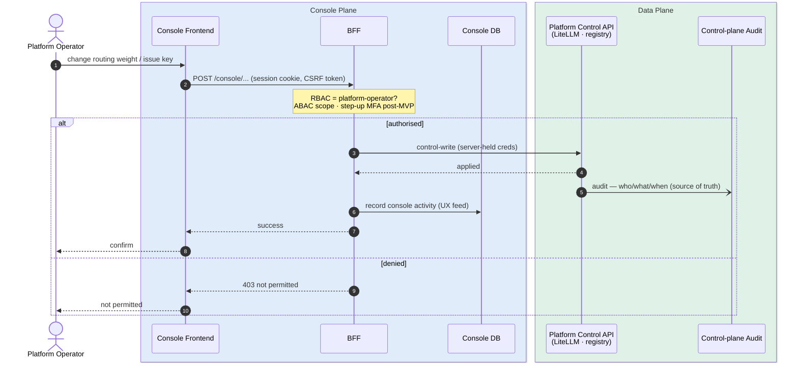
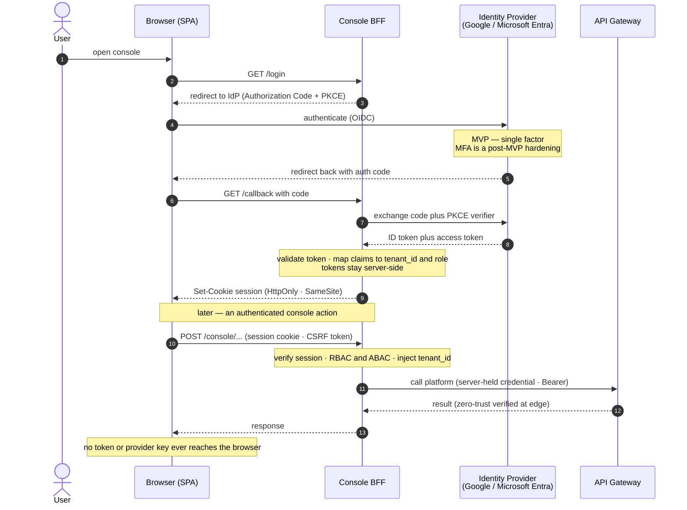
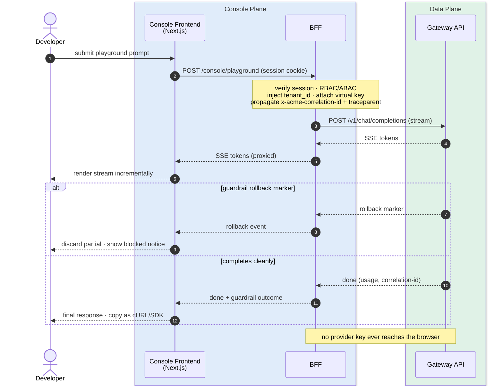

# Unified LLM Inference Gateway — Console & UI Architecture

> The management plane for the Gateway: the web console through which operators, tenant admins, developers, reviewers, and finance interact with the platform. This document is a peer to [`be-architecture.md`](./be-architecture.md) (the API/inference plane) and is intended to be built and deployed **independently**. It has its own frontend, its own backend-for-frontend, its own database, and its own observability stack — none of which the inference data plane depends on.

---

## Table of Contents

1. [System Architecture — Console Plane](#1-system-architecture--console-plane)
2. [Scope & Relationship to the Gateway](#2-scope--relationship-to-the-gateway)
3. [Personas & Surfaces](#3-personas--surfaces)
4. [Information Architecture & Screen Inventory](#4-information-architecture--screen-inventory)
5. [Frontend Architecture](#5-frontend-architecture) — including Accessibility, Embedded tool seams, Empty-state handling
6. [Backend-for-Frontend (BFF)](#6-backend-for-frontend-bff)
7. [Console Database](#7-console-database)
8. [Authentication & Authorization](#8-authentication--authorization)
9. [Integration with Platform Services](#9-integration-with-platform-services)
10. [Realtime & Streaming](#10-realtime--streaming)
11. [Buy vs Build](#11-buy-vs-build)
12. [Observability — Console Stack](#12-observability--console-stack)
13. [Frontend Security](#13-frontend-security)
14. [Infrastructure & Deployment](#14-infrastructure--deployment)
15. [Implementation Roadmap](#15-implementation-roadmap)
16. [Full Stack Summary](#16-full-stack-summary)

---

## 1. System Architecture — Console Plane

```
┌─────────────────────────────────────────────────────────────────────┐
│  BROWSER                                                            │
│  Operators · tenant admins · developers · reviewers · FinOps         │
└──────────────────────────────┬──────────────────────────────────────┘
                               ↓  HTTPS (session cookie, CSP, mTLS optional)
┌─────────────────────────────────────────────────────────────────────┐
│  EDGE / CDN                                                         │
│  Static assets · TLS · WAF · DDoS · SSO redirect                    │
└──────────────────────────────┬──────────────────────────────────────┘
                               ↓
┌─────────────────────────────────────────────────────────────────────┐
│  CONSOLE FRONTEND            Next.js (App Router) · React · SSR/RSC  │
│  Screens · component system · client state · streaming playground    │
└──────────────────────────────┬──────────────────────────────────────┘
                               ↓  same-origin, no provider keys in browser
┌─────────────────────────────────────────────────────────────────────┐
│  BACKEND-FOR-FRONTEND (BFF)  Node/FastAPI · session · authZ · aggreg │
│  Aggregates platform APIs · enforces RBAC/ABAC · owns Console DB     │
└───────┬───────────────────────────────────────────────┬─────────────┘
        ↓ reads/writes                                   ↓ reads (never mutates truth)
┌───────────────────────┐        ┌──────────────────────────────────────┐
│  CONSOLE DATABASE     │        │  PLATFORM SERVICES (data plane)      │
│  Postgres (own inst.) │        │  LiteLLM · Langfuse · Prometheus     │
│  Presentation +       │        │  Model registry · Review queue (§17) │
│  workflow + prefs     │        │  Cost ledger (Postgres L4) · Vault   │
└───────────────────────┘        └──────────────────────────────────────┘
```

> **Design rule:** the console is a **control-plane** application. It never sits on the inference request path — if the entire console is down, `POST /v1/chat/completions` keeps serving. Nothing in the data plane calls the console; the dependency arrow only ever points console → platform.

---

## 2. Scope & Relationship to the Gateway

| Plane | Document | Owns |
|-------|----------|------|
| **Data / inference** | [`be-architecture.md`](./be-architecture.md) | The API contract, routing, guardrails, KV memory, cost ledger, the platform's operational stores. |
| **Management / console** | this document | The web UI, its BFF, its own database, and its own frontend observability. |

What this document **owns**: screens, personas, the BFF, the Console DB, console session/auth, frontend telemetry, buy-vs-build for each surface.

What it **does not own** (source of truth stays in the data plane): inference traffic, virtual API keys, spend/cost truth, traces, eval scores, the control-plane audit log (§8 of `be-architecture.md`). The console **reads** these via platform APIs and **writes** control actions back through them — it never keeps a second authoritative copy.

> **Principle:** the console is a *view and a workflow layer* over the platform, not a fork of its data. Every number on a screen traces to a platform API or store; the Console DB holds only presentation, workflow, and preference state (Section 7).

---

## 3. Personas & Surfaces

| Persona | Identity | Primary need | Console tier |
|---------|----------|--------------|--------------|
| **Platform operator** | Operator SSO + MFA | Run the platform: model registry, routing, guardrail tuning, policy-as-code, global health. | Operator console |
| **Tenant admin** | Tenant SSO | Run their tenant: members, budgets, model allowlist, data-residency, spend. | Tenant console |
| **Developer / consumer** | Tenant SSO or API-key onboarding | Self-serve keys, read docs, see quota/usage, try the playground. | Developer portal |
| **Reviewer** | Reviewer role (scoped) | Work the human-review queue: approve / edit / reject held responses (§17). | Review console |
| **FinOps / finance** | Finance role (read-mostly) | Cost attribution, chargeback, budget-vs-burn, exports. | FinOps console |

> **Design rule:** one persona never sees another tenant's data. Every screen is scoped by `tenant_id` at the BFF via ABAC (Section 8), mirroring the tenant-isolation boundary in `be-architecture.md` §5 — isolation is enforced server-side, never by hiding UI.

---

## 4. Information Architecture & Screen Inventory
    
### Operator console
- **Model registry** — logical aliases (`acme/gpt4o`), backing deployment, health, routing weight, access policy. *Custom (the one screen `be-architecture.md` §21 says to build).*
- **Model qualification & progressive delivery** — the workflow screen for the MLOps pipeline (`be-architecture.md` §9). Shows each alias's current stage (offline eval → shadow → canary → full rollout), qual gate results (quality/safety/cost/latency vs baseline), promotion controls (advance stage / hold / rollback in one config flip), and canary traffic-split dial. A safety regression always hard-blocks promotion; the screen makes that state visible and auditable. This is the most frequently used operator screen after the registry.
- **Tenant lifecycle management** — provision a new tenant (allocate `tenant_id`, create scoped store partitions in Redis/Qdrant/Postgres/Langfuse, set initial quota + guardrail posture + model allowlist) and deprovision (trigger the fan-out erasure job across all five stores, per `be-architecture.md` §5 and §11). Shows provisioning status per store and the proof-of-erasure audit record on offboard.
- **Routing & fallback** — fallback chains, circuit-breaker status, burst-to-hosted config.
- **Guardrail tuning** — per-rail thresholds, fail-open/closed posture, degraded-mode banner, block samples.
- **Policy-as-code review** — diff + promote config changes (config lives in git; console shows state and pending changes).
- **Alert & webhook management** — configure and test budget-alert webhooks (`be-architecture.md` §2), regression/error-budget alarms (`be-architecture.md` §7), and guardrail-anomaly alerts (`be-architecture.md` §10). Each alert entry shows: trigger condition, destination (webhook URL or email), last-fired time, and silence/snooze controls. Operator-scoped; tenant admins have a tenant-scoped subset.
- **DSAR & erasure workflow** — compliance screen for running Data Subject Access Requests and right-to-erasure jobs (`be-architecture.md` §11). DSAR: assemble a subject's data across all stores (Postgres, Qdrant, Redis, Langfuse) and export within the statutory window. Erasure: trigger the orchestrated fan-out delete, track per-store completion status, and download the proof-of-deletion audit record (the one thing kept after erasure). Legal-hold override: record and release holds per scope.
- **Global health** — provider status, GPU pool, queue depth, degraded-guardrails state, backup verification status, DR runbook links.

### Tenant console
- **Members & roles** — invite, assign RBAC role, revoke.
- **Budgets & quota** — set budget, per-key/per-model limits, view burn; soft-cap vs hard-cap toggle (`be-architecture.md` §16 — hard cap returns 429, soft cap allows + alerts).
- **Model allowlist & residency** — which aliases and which regions this tenant may call.
- **Tenant spend** — cost per model / use-case / day (reads FinOps data, tenant-scoped).
- **Rate-limit observability** — live view of each token bucket's state: current TPM/RPM remaining, refill-time estimate, concurrency in-flight, and which bucket last tripped a 429 with the `x-acme-ratelimit-scope` value (`be-architecture.md` §6). Helps developers self-diagnose throttling before raising a support ticket.
- **Alert subscriptions** — tenant-scoped budget alerts and anomaly notifications; configure webhook or email destinations without requiring operator access.

### Developer portal
- **API keys** — self-issue / rotate / revoke virtual keys (LiteLLM), scoped to the developer's tenant.
- **Usage & quota** — request volume, token spend, rate-limit headroom, `RateLimit-*` state.
- **Rate-limit detail** — drill-down from the quota summary: per-bucket breakdown (tenant-tpm, key-rpm, provider-org, budget), current fill level, and the `Retry-After` value for any active 429. Lets a developer understand exactly which limit they hit and when it resets.
- **Batch API management** — submit a JSONL batch file, monitor job lifecycle (`validating → in_progress → finalizing → completed`), view partial error file alongside output file, download results, and cancel in-flight jobs (`be-architecture.md` §14). Correlates each batch to its `x-acme-correlation-id` for tracing. Poll or receive webhook notification on terminal state.
- **Docs & SDK** — versioned OpenAI-compatible reference, error taxonomy (`be-architecture.md` §23), quickstarts.
- **Playground / sandbox** — send a guarded request, stream the response, inspect guardrail outcome, copy as cURL/SDK. Correlates by `x-acme-correlation-id`.
- **Model comparison playground** — send one prompt to **several models/aliases at once** and stream all responses **side by side** (synchronised columns, each streaming independently over its own SSE channel through the BFF). Surfaces per-model latency (TTFT + total), token counts, and cost per response, plus a **diff view** to eyeball where outputs disagree. This is the screen operators and developers actually use to pick a model or validate a routing/alias change before promotion (feeds the qualification workflow, `be-architecture.md` §9/§10) — a "10× developer" surface, not a nice-to-have. Guardrails still apply per column; rollback/blocked state renders per model.

### Review console
- **Queue** — held responses (`be-architecture.md` §17), filter by rule/tenant/age, SLA timers with visual burn indicator (time-to-SLA breach). Items show: request, model output, trigger rule + code, tenant, use-case, and `x-acme-correlation-id` — everything needed without leaving the tool.
- **Decision** — approve / edit / reject, with required reason field; four-eyes enforcement for the highest tier (a second reviewer must act before release); decision fed back to the golden eval set (`be-architecture.md` §10).
- **Claim-lease on queue items (no double-review).** The queue is worked by multiple reviewers at once, so an item must be **claimed** before it can be decided, or two reviewers redundantly (or contradictorily) action the same held response. Each item runs a small state machine — `queued → claimed{by, at, expires} → decided` (with `expired → queued` return) — enforced **server-side in the BFF**, not by hiding buttons. Opening an item takes a **pessimistic lease** (default 5-minute TTL); the lease auto-renews while the reviewer is active and **auto-expires** if they walk away, returning the item to the queue so work is never stranded. A decision is only accepted from the current lease holder; four-eyes still requires the *second* reviewer to take their own fresh claim. Lease state is broadcast in realtime (§10) so every other reviewer sees "claimed by A" the instant it happens and never opens a locked item.
- **SLA escalation** — items approaching SLA breach are auto-escalated and surface as a priority lane; queue depth, time-to-decision, and approve/reject rates per rule appear on a supervisor dashboard so a flooding rule is caught as a guardrail-tuning signal.
- **History** — past decisions, reviewer, input seen, outcome, and reason — immutable, correlated by `x-acme-correlation-id`, exportable for audit.

### FinOps console
- **Attribution** — cost per tenant / model / use-case / day, cache-hit savings, batch-vs-interactive split, cost-per-successful-outcome (`be-architecture.md` §16).
- **Budget vs burn** — time-series chart of cumulative spend against budget for each tenant and API key; burn rate projected to end-of-period; visual warning as spend approaches soft cap, critical at hard cap. Anomaly detection (`be-architecture.md` §16) flags unusual spend patterns with a drill-down to the causative requests.
- **Hard-cap & soft-cap management** — per-tenant, per-key caps configurable here; hard cap blocks requests (429) while soft cap allows + fires an alert. Operator and tenant-admin can set limits within their respective authority scope.
- **Chargeback & exports** — monthly statements per tenant, async report/export jobs (JSONL/CSV); job status tracked in Console DB, result pointer served on completion.

---

## 5. Frontend Architecture

- **Framework** — Next.js (App Router) with React Server Components; SSR for first paint and authZ-gated pages, client components for interactive surfaces (playground, queue). Consistent with the Next.js model-registry admin already named in `be-architecture.md` §21.
- **Component system** — a single design-system package (tokens, primitives, data tables, charts) shared across all five consoles so surfaces stay visually and behaviourally consistent.
- **Client state** — server state via a query cache (TanStack Query or equivalent) keyed by the BFF endpoints; minimal global client state (session, feature flags, active tenant).
- **Data tables & charts** — virtualised tables for high-cardinality lists (keys, traces, queue); charts render from BFF-shaped series, never from raw provider payloads.
- **No provider secrets in the browser, ever.** The playground calls the BFF, which calls the platform; virtual keys and provider credentials never reach client JavaScript (Section 13).

### Accessibility

- **WCAG 2.1 AA compliance is a hard requirement**, not a post-ship retrofit. The review console and FinOps console handle workflow decisions and financial data that in many jurisdictions carry legal accessibility obligations (EN 301 549 in the EU; Section 508 in the US). Required: keyboard navigability of all interactive surfaces (queue decisions, model promotion controls), ARIA roles on dynamic regions (live queue updates, streaming playground output), sufficient colour contrast ratios (4.5:1 text, 3:1 UI components), and visible focus states throughout. Screen-reader testing (NVDA/JAWS/VoiceOver) runs as a required CI gate alongside visual regression.
- **`prefers-reduced-motion`** — streaming animations and chart transitions respect the OS motion-reduction preference; use opacity fades not positional transitions as the reduced-motion alternative.

### Embedded tool seams (Langfuse, Grafana)

Langfuse and Grafana are embedded inside the console shell. The seam must be invisible to the user and secure.

- **Auth passthrough** — the BFF issues a short-lived, scoped embed token (Langfuse service-account token or Grafana viewer token) on each page load; the token is injected server-side into the embed URL or as a `Bearer` header via a BFF proxy, never stored in client state. The embed token carries only the permissions the current console session has — a developer cannot elevate to operator-level Langfuse access through the embed. Tokens expire with the console session.
- **Tenant scoping in embeds** — Langfuse embeds are restricted to the current `tenant_id`'s project; Grafana panels are pre-filtered by tenant label. The BFF constructs the embed URL with those filters baked in; the frontend never constructs the embed URL itself.
- **Visual seam** — the design system defines a shared token set (background, border, font) that is applied to wrapper components surrounding each embed. Embeds that cannot be themed (Grafana in light mode against a dark console shell) are rendered inside a framed card with a consistent border and header, so the context break is deliberate and labelled rather than jarring.
- **Error isolation** — a failed embed (Langfuse unreachable, Grafana timeout) renders a contained error card with a "retry" action rather than breaking the page. The rest of the console remains functional.

### Empty states and platform-unavailable handling

The console reads from the data plane; any platform dependency can degrade. Every data-fetching screen must account for this.

- **Degraded vs empty** — distinguish "no data yet" (a new tenant with no traffic) from "data unavailable" (Langfuse or Prometheus is down). Use different UI treatments: an onboarding prompt for the former, an explicit "Service temporarily unavailable — data may be stale" banner with a timestamp for the latter.
- **BFF signals health** — the BFF wraps each upstream call with a health envelope `{ data, source_status: "ok" | "degraded" | "unavailable", as_of: timestamp }` so the frontend can render stale-data indicators without knowing which upstream failed.
- **Partial-page degradation** — a screen composed from multiple sources (e.g. the operator health screen aggregates LiteLLM + Prometheus + Langfuse) renders available panels immediately and shows a per-panel error state for unavailable ones. The page never blocks entirely on one upstream.
- **Retry and refresh** — unavailable panels show a manual "retry" button; the query cache has a configured stale-while-revalidate window so momentary blips don't flash error states to users.

---

## 6. Backend-for-Frontend (BFF)

A dedicated BFF sits between the frontend and the platform. It exists because the browser must not hold platform credentials, must not fan out to five services, and must not be trusted to enforce authZ.

**Responsibilities**
- **Session & auth** — terminate the console session (Section 8); exchange SSO identity for a short-lived server session; hold platform service credentials server-side.
- **AuthZ enforcement** — apply RBAC/ABAC on every request; inject `tenant_id` scoping so a compromised client cannot widen its own view.
- **Aggregation** — compose one screen from many platform APIs (LiteLLM + Langfuse + Prometheus + registry) into a single shaped response; avoids chatty cross-origin calls from the browser.
- **Owns the Console DB** — all reads/writes to presentation, workflow, and preference state (Section 7) go through the BFF.
- **Control writes** — mutations (issue key, change budget, promote config, decide a review) are forwarded to the platform's versioned control-plane admin API (`be-architecture.md` §22 → *Control-Plane (Admin) API*, mounted under `/admin/v1/...`), which remains the source of truth and the audit sink (`be-architecture.md` §8). The BFF authenticates to it with its own service credential carrying the resolved operator identity — never a consumer virtual key.

> **Design rule:** the BFF is the only tier that holds platform credentials and the only tier that decides authZ. The frontend is a rendering client; treat every value it sends as untrusted.

A control-write — operator action, authZ + step-up MFA at the BFF, mutation forwarded to the platform (the source of truth and audit sink), console activity recorded locally:



---

## 7. Console Database

The console needs its **own** database — a separate Postgres instance from the platform's L4/cost-ledger Postgres. It stores what the platform has no reason to hold: presentation, workflow, and preference state.

| Domain | Stored | Notes |
|--------|--------|-------|
| **Console users & role bindings** | SSO subject → console role, active-tenant selection | Identity is the IdP's; this maps IdP subjects to console RBAC roles. |
| **Saved views & layouts** | Pinned filters, dashboard arrangements, saved queries | Pure presentation. |
| **Review workflow state** | Assignment, SLA timers, draft edits, decision reason | The *workflow* around a held response; the held response itself lives in the platform review queue (§17). |
| **Notifications & subscriptions** | Alert prefs, digest schedules, seen/unseen | Console-only. |
| **Console activity feed** | Who opened/exported what in the console | A UX convenience; the authoritative control-plane audit log stays in the platform (§8). Console mutations are forwarded there. |
| **Async jobs** | Report/export job status + result pointer | Long exports run async; the console tracks their state. |
| **Onboarding & feature flags** | Per-user onboarding progress, flag overrides | Console-only. |

> **Design rule:** the Console DB never holds a second authoritative copy of inference traffic, spend, keys, traces, or the audit log. If a value is a business or compliance fact, it lives in the data plane and the console reads it. The Console DB is for *how the user works the console*, not *what the platform did*.

#### Large exports run on a worker, not the request path

Audit-history dumps, cost reports, and DSAR exports (§4) can be **hundreds of MB and take minutes** to assemble. Building one inline in the BFF is a double footgun: it **blocks the event loop** (or ties up a worker) for the duration, and buffering the whole result in memory to stream back **OOMs** the BFF under a few concurrent exports. Never generate a large export in the request that asked for it.

- **Initiate → poll → download, three steps.** `POST /exports` validates + authZ-scopes the request, enqueues a job, and returns `202` with a `job_id`. The BFF's only jobs are to **initiate** and to **report status** (`GET /exports/{id}` → `queued | running | ready | failed`) — it never does the heavy work itself.
- **A dedicated async worker does the assembly.** A background worker (Celery / RQ / BullMQ) pulls the job, streams the query results straight to object storage (S3/GCS) without holding the whole file in memory, and marks the job `ready` with a result pointer (the "Async jobs" row above).
- **Deliver via a short-lived presigned URL.** The client downloads directly from object storage via a **time-boxed presigned URL** — the bytes never transit the BFF, so one big export can't starve interactive traffic. Presigned URLs are tenant/authZ-scoped and expire quickly; the download itself is recorded in the console activity feed.
- **Notify + expire.** Long jobs notify on completion (§10 realtime / email digest) rather than making the user hold the page; generated export artifacts have a retention TTL and are then purged from object storage.

**Operational posture** — its own backup/RPO (workflow and preferences are valuable but re-derivable-lite); erasure obligations follow the same subject-access discipline as `be-architecture.md` §11 for any personal data it holds (reviewer identities, activity).

---

## 8. Authentication & Authorization

- **Control-plane auth.** The console is the control plane described in `be-architecture.md` §8 — operator/admin identities authenticate via the customer's existing **SSO (OIDC)**, entirely separate from the consumer API keys that serve inference. A consumer key never authenticates to the console; a console session never calls inference on a user's behalf without going through the platform.
- **RBAC for coarse roles** — `platform-operator`, `tenant-admin`, `consumer`/developer, `reviewer`, `finance` — mirroring the roles in `be-architecture.md` §8.
- **ABAC for fine control** — the BFF scopes every query by attributes (`tenant_id`, `model`, `data-residency`, `use-case`) so "tenant A's admin sees only tenant A" needs no role explosion.
- **Session** — short-lived, HttpOnly, SameSite cookies; server-side session store. Tokens from the IdP stay server-side in the BFF; the browser only ever holds the session cookie.
- **Break-glass** — the LiteLLM `master_key` is never a console credential; operator actions are individually attributed and audited.
- **Audited impersonation ("act-as").** Support and platform operators sometimes need to **see the console as a specific tenant** to reproduce a bug or verify a config — a real operational need that is also a privilege-escalation and privacy risk if done implicitly. Make it an **explicit, scoped, time-boxed, and audited** action, never a silent `tenant_id` swap: entering act-as requires an operator with the right role, records an immutable audit event capturing `{ operator_id, impersonated_tenant_id, reason, started_at, expires_at }`, and stamps **every** request made during the session with *both* the real operator id and the impersonated tenant so downstream logs and the platform control-plane audit (`be-architecture.md` §8) show who really acted. The session is **read-oriented by default** — mutating a tenant's config or issuing keys while impersonating is either blocked or requires a second explicit confirmation — auto-expires, and shows a persistent "acting as tenant X" banner in the UI so the operator can't forget they're impersonating.

### Recommended pattern (MVP) — OIDC login via the BFF

Keep it simple and standard: **log the user in against the customer's own identity provider, complete the token exchange server-side in the BFF, and hand the browser only an HttpOnly session cookie.** No new identity store to run, no secrets in the browser.

> **Design rule (MVP):** the console uses **OIDC Authorization Code + PKCE** against the customer IdP (Google Workspace or Microsoft Entra ID). The **BFF** performs the code exchange, validates the token, maps its claims to `{ tenant_id, role }`, and issues a server-side session — the SPA never sees a token. **MFA is deferred to post-MVP** (it's enforced at the IdP with no console change) and **SAML is out of scope** for MVP; both slot into this same flow later without rework.

The login flow, then a subsequent authenticated action — the token stays in the BFF, the browser holds only a session cookie, and every platform call is still zero-trust verified at the gateway edge:



---

## 9. Integration with Platform Services

The console is a client of the same services `be-architecture.md` already runs — it adds no new inference dependency.

| Platform service | Console uses it for | Direction |
|------------------|--------------------|-----------|
| **LiteLLM** | Virtual key issue/revoke, per-key spend, model allowlist | Read + control-write |
| **Langfuse** | Traces, eval scores, human-annotation queue, cost analytics | Read (embed or API) |
| **Prometheus / Grafana** | Infra metrics, GPU/queue depth, error rates | Read (embed panels) |
| **Model registry** | Alias → deployment, health, routing weight, access policy | Read + control-write (the custom surface) |
| **Review queue (§17)** | Held responses, enqueue/decide, correlation by `x-acme-correlation-id` | Read + control-write |
| **Cost ledger (Postgres L4)** | FinOps attribution and chargeback | Read via platform API |
| **Vault / KMS** | The BFF fetches its own service creds; never surfaces secrets to the browser | Read (BFF only) |

> **Principle:** prefer embedding or calling the tool that already owns a capability (Langfuse for traces, LiteLLM for keys) over rebuilding it. The console's custom code is the *connective tissue and the two or three screens no tool provides* — model registry, unified navigation, and the tenant/FinOps roll-ups.

---

## 10. Realtime & Streaming

- **Playground streaming** — the sandbox streams tokens over SSE from the BFF (which proxies the platform's streamed response), so developers see the same streaming behaviour real clients get, including guardrail rollback markers (`be-architecture.md` §3 client-SDK contract).
- **Live queue & health** — the review queue and health screens update via SSE/WebSocket from the BFF; no polling storms. The queue channel also carries **item-claim events** (§4) — a claim, renewal, expiry, or decision is pushed to every connected reviewer so lock state is consistent in realtime and two reviewers never open the same item.
- **Backpressure** — realtime channels are per-session and authZ-scoped at the BFF; a dropped socket degrades to on-demand refresh, never to a stale-but-silent screen.

The developer playground streaming through the BFF — tenant scoping and key injection server-side, tokens proxied back over SSE, guardrail rollback handled the same way a real client must:



---

## 11. Buy vs Build

| Surface | Approach | Why |
|---------|----------|-----|
| API keys & spend | **Buy** — LiteLLM UI (embed or API-drive) | Already built, already authoritative. |
| Traces / evals / annotation | **Buy** — Langfuse | Purpose-built; don't reimplement. |
| Infra dashboards | **Buy** — Grafana panels (embedded) | Standard, alerting included. |
| Model registry & routing | **Build** — custom Next.js | No off-the-shelf owner; it's platform-specific. |
| Unified navigation & personas | **Build** — the console shell | Ties the bought surfaces into one authZ-scoped product. |
| Tenant admin & FinOps roll-ups | **Build (thin)** over platform APIs | Cross-cutting views no single tool provides. |
| Review-queue workflow UI | **Build (thin)** over §17 queue | The queue is platform; the working UI is console. |

> **Recommendation:** don't build a monolith UI first. Ship the console **shell + operator model-registry** screen, embed LiteLLM and Langfuse for the rest, and build the tenant/FinOps/review surfaces only where an embedded tool leaves a real gap. This mirrors the buy-first guidance in `be-architecture.md` §21.

---

## 12. Observability — Console Stack

The console has its **own** observability, distinct from the platform's Langfuse/Prometheus stack — because a broken chart, a slow BFF route, or a frontend error is a *console* problem, not an inference problem, and must be diagnosable on its own.

| Layer | Tool | What you get |
|-------|------|-------------|
| **Frontend RUM** | Web-vitals / RUM agent | Core Web Vitals, route timings, real-user latency per screen. |
| **Frontend errors** | Sentry (or equivalent) | JS exceptions, source-mapped stacks, release health, per-persona impact. |
| **Product analytics** | Privacy-respecting analytics | Funnel/adoption (e.g. developers reaching first successful playground call), feature usage. |
| **BFF tracing & metrics** | OpenTelemetry → the platform's Jaeger/Prometheus | BFF span per request, aggregation fan-out latency, Console DB query time, error rate. |
| **Console audit/activity** | Console DB + forward to platform audit | UX activity feed locally; authoritative control-plane audit forwarded to `be-architecture.md` §8. |

- **Correlate across planes.** The BFF propagates `x-acme-correlation-id` (and W3C `traceparent`, per `be-architecture.md` §12) when it calls the platform, so a console action can be traced end-to-end into inference — one id spans both planes.
- **Separate alerting.** Console SLOs (page load, BFF availability, error budget) alert the console owners; they do not page the inference on-call.

> **Design rule:** the console's observability answers "is the console healthy?" independently. It reuses the platform's tracing *backend* (Jaeger/Prometheus) for economy, but its dashboards, SLOs, and alerts are its own.

---

## 13. Frontend Security

- **No secrets in the browser.** Provider keys, virtual keys, and service credentials live only in the BFF/Vault. The client holds a session cookie and nothing else sensitive.
- **CSP + output encoding** — strict Content-Security-Policy, framework auto-escaping, and sanitisation of any model-generated content rendered in the playground (treat model output as untrusted, per the datamarking discipline the platform applies to inbound content).
- **CSRF** — SameSite cookies + anti-CSRF tokens on all state-changing BFF routes.
- **AuthZ server-side only** — the frontend hides controls the user can't use, but the BFF enforces every permission; never trust a hidden button.
- **Dependency & supply chain** — the console inherits the platform's SBOM + scan gate (`be-architecture.md` §8) in its own CI; pinned dependencies, no unvetted third-party script tags.
- **OWASP Top 10 baseline** — the console is a conventional web app and is reviewed against the OWASP Top 10 (injection, broken access control, SSRF from the BFF, etc.) as a required gate.

---

## 14. Infrastructure & Deployment

- **Independently deployable.** The console (frontend + BFF + Console DB) ships as its own service with its own pipeline; it can release on its own cadence without touching the inference plane.
- **Infrastructure as Code.** Console infra — the frontend host/CDN, the BFF service, the Console DB, secrets bindings — is declared in the same Terraform/Pulumi discipline as `be-architecture.md` §15. No console-created production resource.
- **Environments.** dev → staging → prod with the same immutable-artifact promotion as the platform; the console has its own eval/smoke gate (does the playground round-trip a guarded request in staging?).
- **Blast radius.** Because it's control-plane, a bad console deploy degrades management, not inference — but the deploy still follows progressive rollout + automated rollback (`be-architecture.md` §9).

---

## 15. Implementation Roadmap

| Phase | Deliverable | Notes |
|-------|-------------|-------|
| **1 — Shell + auth** | Console shell, SSO+MFA, RBAC/ABAC at the BFF, Console DB bootstrap, BFF health-envelope wrapper | The security spine first; everything hangs off it. BFF health wrapper ships here so all later screens inherit empty-state handling. |
| **2 — Operator MVP** | Model registry + routing screen; model qualification & progressive delivery; embed Grafana health | The must-build surfaces. Qual/delivery screen is critical — model promotions happen from day one. |
| **3 — Tenant lifecycle + alerts** | Tenant provisioning/deprovisioning UI; alert & webhook management; DSAR & erasure workflow | Compliance-critical: GDPR right-to-erasure must be executable before regulated tenants onboard. |
| **4 — Developer portal** | Self-serve keys (LiteLLM), usage/quota, rate-limit detail, batch API management, docs, streaming playground | Unlocks self-service onboarding. Batch management unblocks bulk-processing use cases. |
| **5 — Tenant & FinOps** | Members/budgets/allowlist; hard-cap vs soft-cap management; budget-vs-burn + anomaly detection; chargeback | Cross-cutting roll-ups over platform APIs. Hard-cap controls ship before external tenants. |
| **6 — Review console** | Queue + decide UI over §17, SLA escalation, four-eyes, history | Ties human-review into a working surface. SLA timers and supervisor dashboard ship with the queue. |
| **7 — Embedded tool seams** | Langfuse embed with auth passthrough + tenant scoping; Grafana panel theming; visual seam components | Can be iterative — start with functional embeds and refine the visual seam in a later polish pass. |
| **8 — Console observability + a11y** | RUM, Sentry, product analytics, BFF tracing, SLOs; WCAG 2.1 AA audit and remediation | Make the console diagnosable and accessible. A11y audit runs against every built surface in this phase. |

---

## 16. Full Stack Summary

| Layer | Choice |
|-------|--------|
| **Frontend** | Next.js (App Router) · React Server Components · shared design system · WCAG 2.1 AA |
| **BFF** | Node or FastAPI · session · RBAC/ABAC · aggregation · health-envelope wrapper · owns Console DB |
| **Console database** | Postgres (own instance) — presentation, workflow, preference, alert-sub, and erasure-job state only |
| **Auth** | SSO + MFA (control-plane) · RBAC + ABAC · short-lived server sessions · step-up MFA for high-risk actions |
| **Realtime** | SSE/WebSocket via the BFF (streaming playground, live queue/health, alert feed) |
| **Bought surfaces** | LiteLLM UI (keys/spend) · Langfuse (traces/evals/annotation) · Grafana (infra panels) |
| **Built surfaces** | Console shell · model registry/routing · model qual & delivery · tenant lifecycle · DSAR & erasure · alert management · developer portal (keys, quota, rate-limit detail, batch API) · FinOps (budget-vs-burn, anomaly, hard-cap) · review UI (queue, SLA escalation, four-eyes, history) |
| **Embedded tool seams** | BFF-issued scoped embed tokens · tenant-scoped embed URLs · design-system wrapper components · per-embed error isolation |
| **Empty-state handling** | BFF health-envelope on every upstream · degraded vs empty UI treatment · partial-page render · stale-while-revalidate |
| **Observability** | RUM · Sentry · product analytics · OpenTelemetry BFF spans (reuses platform Jaeger/Prometheus) · console-specific SLOs |
| **Security** | No browser secrets · CSP · CSRF · server-side authZ · SBOM/scan · OWASP Top 10 · `prefers-reduced-motion` |
| **Deployment** | Independent pipeline · IaC · dev→staging→prod · progressive rollout |

> **Principle:** the console is a first-class product built *on* the Gateway, not *into* it. It has its own frontend, database, and observability, deploys on its own cadence, and never becomes a dependency of the inference path — so the platform can serve requests whether or not anyone is looking at it.
