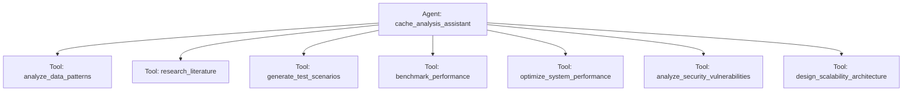

# Cache Analysis Research Assistant

## Overview

This sample demonstrates ADK context caching features using a comprehensive research assistant agent designed to test both Gemini 2.0 Flash and 2.5 Flash context caching capabilities. The sample showcases the difference between explicit ADK caching and Google's built-in implicit caching.

### Key Features

- **App-Level Cache Configuration**: Context cache settings applied at the App level following ADK best practices.
- **Large Context Instructions**: Over 4,200 tokens in system instructions to trigger context caching thresholds.
- **Comprehensive Tool Suite**: 7 specialized research and analysis tools.
- **Multi-Model Support**: Compatible with any Gemini model, automatically adapting the experiment type.
- **Performance Metrics**: Detailed token usage tracking, including `cached_content_token_count`.

## Sample Inputs

- `Hello, what can you do for me?`

  *General question that does not trigger function calls, serving as a baseline query.*

- `What is artificial intelligence and how does it work in modern applications?`

  *General question exploring domain knowledge without specific tool requests.*

- `Use benchmark_performance with system_name='E-commerce Platform', metrics=['latency', 'throughput'], duration='standard', load_profile='realistic'.`

  *Specific request triggering the benchmark_performance tool with explicit parameters.*

- `Call analyze_user_behavior_patterns with user_segment='premium_customers', time_period='last_30_days', metrics=['engagement', 'conversion'].`

  *Specific request triggering data analysis tools with required parameters.*

## Graph



## How To

### 1. Cache Configuration

Context caching is configured at the App level using `ContextCacheConfig`. This ensures that the agent's extensive system instructions and tool definitions are cached for repeated invocations.

```python
from google.adk.agents.context_cache_config import ContextCacheConfig
from google.adk.apps.app import App

cache_analysis_app = App(
    name="cache_analysis",
    root_agent=cache_analysis_agent,
    context_cache_config=ContextCacheConfig(
        min_tokens=4096,
        ttl_seconds=600,  # 10 minutes for research sessions
        cache_intervals=3,  # Maximum invocations before cache refresh
    ),
)
```

### 2. Run Cache Experiments

The `run_cache_experiments.py` script automates the execution of prompts and compares caching performance between models:

```bash
# Test any Gemini model - script automatically determines experiment type
python run_cache_experiments.py <model_name> --output results.json

# Examples:
python run_cache_experiments.py gemini-2.5-flash --output gemini_2_5_results.json

# Run multiple iterations for averaged results
python run_cache_experiments.py gemini-2.5-flash --repeat 3 --output averaged_results.json
```

### 3. Direct Agent Usage

You can also run or debug the agent directly using the ADK CLI:

```bash
# Run the agent directly
adk run contributing/samples/cache_analysis/agent.py

# Web interface for debugging
adk web contributing/samples/cache_analysis
```

### 4. Experiment Types

The script automatically adapts the experiment based on the specified model name:

#### Models with "2.5" (e.g., `gemini-2.5-flash`)

- **Explicit Caching**: ADK explicit caching + Google's implicit caching.
- **Implicit Only**: Google's built-in implicit caching alone.
- **Measures**: The added benefit and performance differences of explicit caching over built-in implicit caching.

#### Other Models (e.g., `gemini-2.0-flash`)

- **Explicit Caching**: ADK explicit caching enabled.
- **Uncached**: Caching completely disabled.
- **Measures**: Baseline performance and cost benefits of context caching.

### 5. Expected Results

- **Performance Improvements**: Simple text agents typically see a 30-70% latency reduction with caching. Tool-heavy agents may experience slight cache setup overhead but still provide significant cost benefits.
- **Cost Savings**: Up to 75% reduction in input token costs for cached content (paying only 25% of normal input cost).
- **Token Metrics**: Successful cache hits are indicated by non-zero `cached_content_token_count` values.

### 6. Troubleshooting

#### Zero Cached Tokens

If `cached_content_token_count` is always `0`:

- Verify model names match exactly (e.g., `gemini-2.5-flash`).
- Check that the `min_tokens` threshold (4,096 tokens) is met by the prompt and system instructions.
- Ensure proper App-based configuration is used rather than passing standalone agents without App wrappers.

#### Session Errors

If you encounter "Session not found" errors:

- Verify `runner.app_name` is used for session creation.
- Ensure correct initialization of `InMemoryRunner` with the `App` object.
