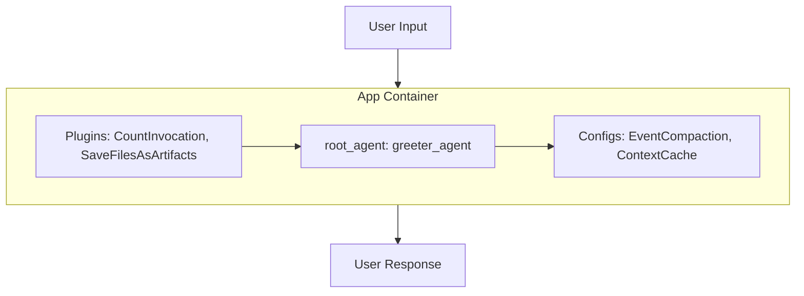

# Application Configuration (App)

## Overview

This sample demonstrates how to configure an `App` in ADK. An `App` serves as the top-level container for an agentic system, wrapping a root agent or workflow and providing application-wide configurations such as plugins, event compaction, and context caching.

## Sample Inputs

- `Hello, who are you?`

  *The application executes `greeter_agent`. The `CountInvocationPlugin` logs the agent and LLM run counts to the console.*

- `Can you help me plan a trip?`

  *As the conversation continues, event compaction automatically summarizes past turns every 2 invocations, while context caching optimizes token usage.*

## Graph



## How To

### Wrapping an Agent in an App

To configure application-level behaviors, instantiate an `App` object and pass your root agent to the `root_agent` parameter:

```python
from google.adk import Agent
from google.adk.apps.app import App

root_agent = Agent(
    name="greeter_agent",
    instruction="You are a friendly assistant.",
)

app = App(
    name="app",
    root_agent=root_agent,
)
```

### Configuring Application Plugins

Plugins provide cross-cutting capabilities (such as telemetry, custom logging, or artifact saving) across the entire application. Pass a list of plugin instances to `plugins`:

```python
from google.adk.plugins.save_files_as_artifacts_plugin import SaveFilesAsArtifactsPlugin

app = App(
    name="app",
    root_agent=root_agent,
    plugins=[
        CountInvocationPlugin(),
        SaveFilesAsArtifactsPlugin(),
    ],
)
```

### Configuring Event Compaction and Caching

The `App` container is also where you define long-term session behavior and optimization strategies:

- **`events_compaction_config`**: Manages token usage by periodically summarizing older turns in a session.
- **`context_cache_config`**: Enables prompt caching across invocations to reduce latency and cost.

```python
from google.adk.apps.app import EventsCompactionConfig
from google.adk.agents.context_cache_config import ContextCacheConfig

app = App(
    name="app",
    root_agent=root_agent,
    events_compaction_config=EventsCompactionConfig(
        compaction_interval=2,
        overlap_size=1,
    ),
    context_cache_config=ContextCacheConfig(
        cache_intervals=10,
        ttl_seconds=1800,
        min_tokens=1000,
    ),
)
```
