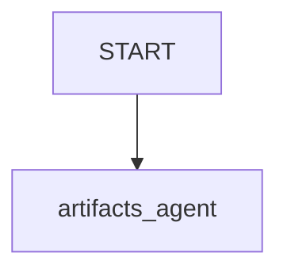

# Artifacts Sample

## Overview

This sample demonstrates how to use the Artifacts feature in ADK to handle different media types (image, audio, video), formats (text, HTML), and artifact versions. Artifacts allow agents to save large pieces of data or binary files outside the main conversation history to avoid cluttering the LLM context window. The agent can then load these artifacts when needed.

This sample showcases:

- Generating and saving a valid **Image** (BMP).
- Generating and saving a valid **Audio** file (WAV).
- Generating and saving a valid **Video** file (MP4) using OpenCV.
- Generating reports in both **Text** and **HTML** formats.
- Automatic handling of **Artifact Versions**.

## Sample Inputs

- `Generate a text report about AI agents`

- `Generate an HTML report about AI agents`

- `Generate a dummy image artifact`

- `Generate a dummy audio artifact`

- `Generate a dummy video artifact`

- `Load the latest version of the image artifact`

## Graph



## How To

1. **Text and HTML Reports**: The `generate_report` tool allows generating reports in either `text` or `html` format. It saves the content with the appropriate MIME type (`text/plain` or `text/html`) and file extension (`.txt` or `.html`).
1. **Media Artifacts**: The `generate_media_artifact` tool demonstrates how to save binary data (image, audio, video) as artifacts using `types.Part.from_bytes` and `ctx.save_artifact`.
   - **Image**: Generated manually as a valid 100x100 red BMP file using standard libraries.
   - **Audio**: Generated manually as a valid 1-second sine wave WAV file using standard libraries.
   - **Video**: Generated as a valid 3-second MP4 file with a moving square using OpenCV (codec `avc1` for better compatibility).
1. **Versioning**: The `generate_report` tool creates a new version of the artifact every time it is called with the same format (`text` or `html`), as it uses fixed filenames (`report.txt` or `report.html`). The version number is returned to the user.
1. **Loading Latest Version**: The standard `LoadArtifactsTool` (available as `load_artifacts` to the model) can be used to load the latest version of any artifact, including media files.

## Dependencies

To generate the video artifact, the sample requires `opencv-python` and `numpy`. You can install them with:

```bash
pip install opencv-python numpy
```

If these libraries are not installed, the tool will return a helpful error message explaining how to install them, while image and audio generation will still work.
