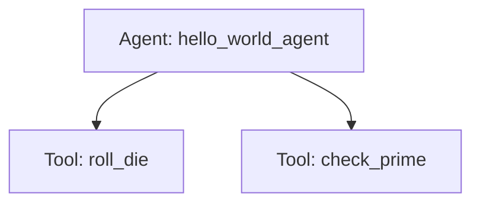

# Hello World Assistant

## Overview

This sample demonstrates a foundational ADK standalone agent that interacts with a user, manages session state via `ToolContext`, and uses multiple tools. Specifically, it features a `hello_world_agent` that can roll an N-sided die (storing roll history in the session state) and check whether numbers in a list are prime.

## Sample Inputs

- `Hi`

  *General greeting that does not trigger tool calls.*

- `Roll a dice with 100 sides`

  *The agent invokes the `roll_die` tool with `sides=100`. The rolled result is appended to the session's `ToolContext` state under the `'rolls'` key.*

- `Roll a dice again with 100 sides.`

  *The agent invokes `roll_die` again, appending a second roll to the session state.*

- `What numbers did I got?`

  *The agent references the conversation history and previous tool outcomes to summarize the rolled numbers.*

- `Roll a die with 8 sides and check if the result is prime.`

  *Demonstrates multi-step tool orchestration. The agent first calls `roll_die(sides=8)`, waits for the response, and then calls `check_prime(nums=[...])` with the rolled result before formulating its final response.*

## Graph



## How To

### 1. Defining Tools with ToolContext

Demonstrates how tools can access and modify persistent session state by including `tool_context: ToolContext` as a parameter.

```python
def roll_die(sides: int, tool_context: ToolContext) -> int:
  result = random.randint(1, sides)
  if not 'rolls' in tool_context.state:
    tool_context.state['rolls'] = []
  tool_context.state['rolls'] = tool_context.state['rolls'] + [result]
  return result
```

### 2. Configuring Safety Settings

Demonstrates adjusting `GenerateContentConfig` safety settings to prevent false alarms (e.g., avoiding harm category triggers when discussing rolling dice).

```python
root_agent = Agent(
    model='gemini-3-flash-preview',
    name='hello_world_agent',
    ...
    generate_content_config=types.GenerateContentConfig(
        safety_settings=[
            types.SafetySetting(
                category=types.HarmCategory.HARM_CATEGORY_DANGEROUS_CONTENT,
                threshold=types.HarmBlockThreshold.OFF,
            ),
        ]
    ),
)
```

### 3. Running and Inspecting the Agent Programmatically

You can execute the agent and inspect its session state programmatically by initializing an `InMemoryRunner`, creating a session, and executing prompts asynchronously:

```python
runner = InMemoryRunner(agent=agent.root_agent, app_name='my_app')
session = await runner.session_service.create_session('my_app', 'user1')

async for event in runner.run_async(
    user_id='user1',
    session_id=session.id,
    new_message=types.Content(...),
):
  # Process execution events
  pass

# Inspect modified session state
session = await runner.session_service.get_session('my_app', 'user1', session.id)
print(session.state['rolls'])
```
