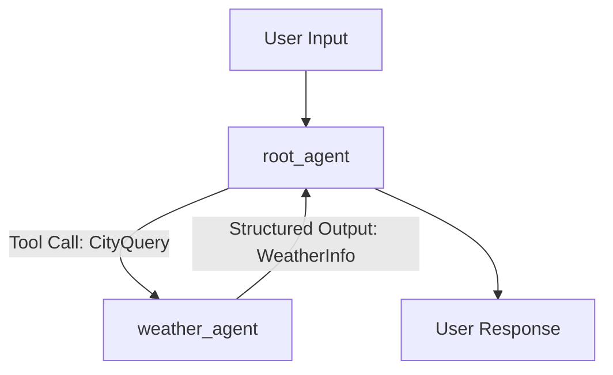

# Input and Output Schema

## Overview

This sample demonstrates how to configure structured `input_schema` and `output_schema` on an ADK agent. When configured with these schemas and `mode='single_turn'`, the agent can be seamlessly used as a structured tool by a parent agent.

## Sample Inputs

- `What is the weather in San Jose?`

  *The parent agent calls `weather_agent` with `{"city": "San Jose"}`. The sub-agent returns `{"temperature": "26 C", "conditions": "Sunny"}`. The parent agent then formulates a friendly response.*

- `Can you check the weather for Cupertino?`

  *The parent agent calls `weather_agent` with `{"city": "Cupertino"}`. The sub-agent returns `{"temperature": "16 C", "conditions": "Foggy"}`.*

## Graph



## How To

### Configuring Input and Output Schemas

To define structured input and output contracts for an agent, pass Pydantic models to the `input_schema` and `output_schema` parameters of the `Agent` constructor:

```python
class CityQuery(BaseModel):
  city: str = Field(description="The name of the city")

class WeatherInfo(BaseModel):
  temperature: str = Field(description="The temperature in Celsius")
  conditions: str = Field(description="The weather condition")

weather_agent = Agent(
    name="weather_agent",
    mode="single_turn",
    input_schema=CityQuery,
    output_schema=WeatherInfo,
    instruction="Provide weather information for the requested city.",
)
```

### Using the Agent as a Tool

When `weather_agent` is included in the `sub_agents` list of `root_agent`, the ADK framework automatically wraps it in an `AgentTool`. The parent agent sees a tool that accepts `CityQuery` parameters and returns `WeatherInfo`.

When the tool is invoked, the framework executes `weather_agent` in an isolated context, validates its input against `input_schema`, and validates its generated response against `output_schema`.
