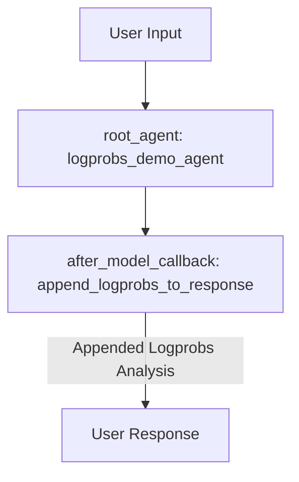

# Log Probabilities Demo Agent

## Overview

This sample demonstrates how to access and display log probabilities from language model responses using the `avg_logprobs` and `logprobs_result` fields in `LlmResponse`. It shows how to configure an ADK agent to request log probabilities and how to use an `after_model_callback` to analyze and append confidence metrics to the response.

## Sample Inputs

- `What is the capital of France?`

  *A factual, straightforward question. The agent will answer confidently (e.g., "Paris"), resulting in a high average log probability and confidence score near 100%.*

- `What are the philosophical implications of artificial consciousness?`

  *A complex, open-ended question. The agent will provide a nuanced answer with varied vocabulary, resulting in a lower average log probability and medium/low confidence score.*

## Graph



## How To

### 1. Enabling Log Probabilities

To enable log probability collection, configure `generate_content_config` on the `Agent` using `types.GenerateContentConfig`:

```python
from google.genai import types

root_agent = Agent(
    name="logprobs_demo_agent",
    generate_content_config=types.GenerateContentConfig(
        response_logprobs=True,  # Enable log probability collection
        logprobs=5,  # Collect top 5 alternatives for analysis
        temperature=0.7,
    ),
    after_model_callback=append_logprobs_to_response,
)
```

### 2. Extracting Log Probabilities in a Callback

The `after_model_callback` receives the `LlmResponse` object, which contains the `avg_logprobs` and `logprobs_result` fields. You can use this data for confidence analysis, quality filtering, or appending information to the response content:

```python
async def append_logprobs_to_response(
    callback_context: CallbackContext, llm_response: LlmResponse
) -> LlmResponse:
  if llm_response.avg_logprobs is not None:
    print(f"📊 Average log probability: {llm_response.avg_logprobs:.4f}")

    # Analyze confidence
    confidence_level = (
        "High" if llm_response.avg_logprobs >= -0.5
        else "Medium" if llm_response.avg_logprobs >= -1.0
        else "Low"
    )

    # Access detailed candidates
    if llm_response.logprobs_result and llm_response.logprobs_result.top_candidates:
      num_candidates = len(llm_response.logprobs_result.top_candidates)

  return llm_response
```

### 3. Understanding Log Probabilities

- **Range**: -∞ to 0 (0 = 100% confident, -1 ≈ 37% confident, -2 ≈ 14% confident)
- **Confidence Levels**:
  - **High**: `>= -0.5` (typically factual, straightforward responses)
  - **Medium**: `-1.0` to `-0.5` (reasonably confident responses)
  - **Low**: `< -1.0` (uncertain or complex responses)
- **Use Cases**: Quality control, uncertainty detection, and response filtering.
