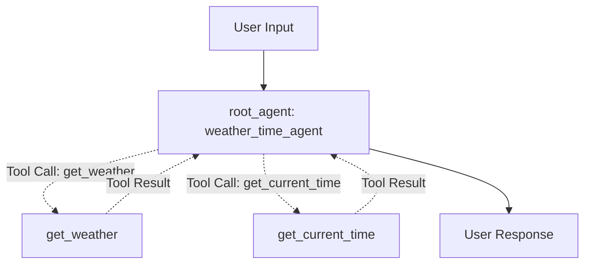

# Weather & Time Quickstart Agent

## Overview

This sample demonstrates a fundamental standalone ADK `Agent` configured with multiple tools. It illustrates how an agent can autonomously select and execute Python functions (`get_weather` and `get_current_time`) to gather real-world information and answer user inquiries.

## Sample Inputs

- `What is the weather in New York?`

  *The agent will invoke the `get_weather` tool with `city="New York"` and return the current weather report.*

- `What time is it in New York?`

  *The agent will invoke the `get_current_time` tool with `city="New York"` and return the current timestamp.*

- `Can you tell me the weather in Tokyo?`

  *The agent will attempt to invoke `get_weather`, which returns an error status for cities other than New York, and gracefully explain that the information is unavailable.*

## Graph



## How To

### 1. Defining Tools

In ADK, standard Python functions with type hints and docstrings can be used directly as tools. The docstring and parameter type hints inform the language model when and how to invoke the function:

```python
def get_weather(city: str) -> dict:
  """Retrieves the current weather report for a specified city.

  Args:
      city (str): The name of the city for which to retrieve the weather report.

  Returns:
      dict: status and result or error msg.
  """
  if city.lower() == "new york":
    return {
        "status": "success",
        "report": (
            "The weather in New York is sunny with a temperature of 25 degrees"
            " Celsius (77 degrees Fahrenheit)."
        ),
    }
  else:
    return {
        "status": "error",
        "error_message": f"Weather information for '{city}' is not available.",
    }
```

### 2. Configuring the Agent

To equip an agent with tools, instantiate an `Agent` and pass the functions in the `tools` parameter list, along with clear instructions and description:

```python
from google.adk.agents.llm_agent import Agent

root_agent = Agent(
    name="weather_time_agent",
    description=(
        "Agent to answer questions about the time and weather in a city."
    ),
    instruction=(
        "I can answer your questions about the time and weather in a city."
    ),
    tools=[get_weather, get_current_time],
)
```
