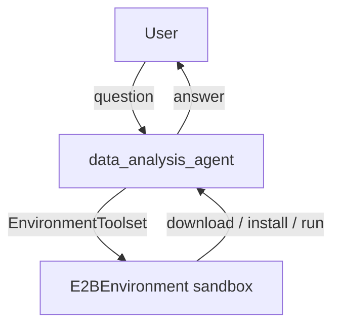

# E2B Environment Sample

## Overview

A small data analysis agent that uses the `E2BEnvironment` with the
`EnvironmentToolset` to download public datasets and analyze them inside an
[E2B](https://e2b.dev) remote sandbox.

Instead of running on the local machine, all commands and file operations
execute in an isolated remote sandbox with internet access. Asked a question,
the agent downloads a public dataset (a GCS-hosted world population /
demographics dataset by default), installs `pandas` on demand, writes a short
analysis script, runs it, and reports the result — all without touching the
user's machine. This makes the sandbox a natural fit for running
model-generated code safely and keeping the host clean.

The sandbox has a bounded time-to-live (`timeout`, in seconds) to cap credit
usage. The TTL is reset on every operation, so an actively used workspace never
expires mid-task; after genuine idle it expires and is transparently recreated
on the next operation (note: workspace state such as installed packages and
files is lost on recreation).

## Prerequisites

1. Install the `e2b` extra:

   ```bash
   pip install google-adk[e2b]
   ```

1. Set your E2B API key (get one at https://e2b.dev):

   ```bash
   export E2B_API_KEY="your-api-key"
   ```

## Sample Inputs

- `Download the world demographics dataset and tell me which country has the largest population.`

  The agent downloads the dataset, installs `pandas`, filters to country-level
  rows, and finds the maximum. Expected: China (`CN`), ≈ 1.44 billion, just
  ahead of India (`IN`) at ≈ 1.38 billion.

- `For the United States, what is the urban vs rural population split?`

  A follow-up to the previous turn. Because the sandbox persists across the
  session, the agent reuses the already-downloaded CSV and the installed
  `pandas` — it only writes and runs a new script. Expected for `US`: urban
  ≈ 270.7 million vs rural ≈ 57.6 million (out of ≈ 331 million total).

- `Using https://storage.googleapis.com/cloud-samples-data/bigquery/us-states/us-states.csv, how many US states are listed?`

  Demonstrates pointing the agent at your own dataset URL instead of the
  default.

## Graph



## How To

The agent is a standalone `Agent` (no workflow graph) wired to a single
`EnvironmentToolset` whose `environment` is an `E2BEnvironment`:

```python
from google.adk.integrations.e2b import E2BEnvironment
from google.adk.tools.environment import EnvironmentToolset

EnvironmentToolset(
    environment=E2BEnvironment(image="base", timeout=300),
)
```

- `image` selects the E2B template (defaults to the public `base` template).
- `timeout` bounds the sandbox lifetime in seconds to cap credit usage; it is
  reset on every operation.

The default GCS-hosted demographics CSV is a standard CSV with a header row.
Each row is one location identified by `location_key`: country-level rows use a
two-letter ISO code (e.g. `US`, `CN`), while subregions use keys containing an
underscore (e.g. `US_CA`). The agent's instruction documents this schema — in
particular, to filter out underscore keys when a question is about countries —
so the generated analysis script parses and aggregates the file correctly.
