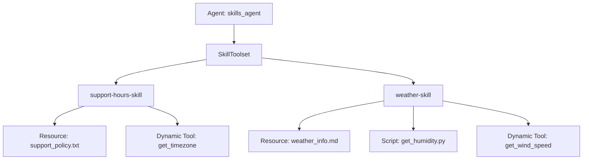

# ADK Skills Agent Sample

## Overview

This sample demonstrates how to use **Skills** and the **SkillToolset** in ADK.

Skills are specialized folders of instructions, reference materials, assets, and scripts that extend an agent's capabilities. The agent can dynamically search for, load, and run resources/scripts from these skills depending on the user's query.

This sample showcases:

1. **Programmatic Skills**: Creating a skill directly within Python (`support-hours-skill`).
1. **Directory-based Skills**: Loading a skill from a directory structure (`weather-skill`).
1. **Skill Metadata & Additional Tools**: Declaring that a skill requires specific tools, making them dynamically active only when that skill is loaded.
1. **Script Execution**: Executing a Python script inside a skill using a code executor.

## Sample Inputs

- `What are the support hours for Tokyo?`

  *Triggers the support-hours-skill which checks get_timezone and reads support_policy.txt*

- `What is the current weather in SF?`

  *Loads weather-skill and reads weather_info.md reference file*

- `Can you fetch the current humidity for Mountain View?`

  *Executes scripts/get_humidity.py via run_skill_script*

- `What is the wind speed in Seattle?`

  *Loads weather-skill which dynamically activates and calls get_wind_speed*

## Graph



## How To

### 1. Declaring a Skill Programmatically

You can declare a skill in Python code using `models.Skill`:

```python
from google.adk.skills import models

support_hours_skill = models.Skill(
    frontmatter=models.Frontmatter(
        name="support-hours-skill",
        description="A skill to check customer support hours...",
        metadata={"adk_additional_tools": ["get_timezone"]},
    ),
    instructions="Step 1: Look up the timezone... Step 2: Read 'references/support_policy.txt'...",
    resources=models.Resources(
        references={
            "support_policy.txt": "Customer support is available Monday through Friday...",
        },
    ),
)
```

### 2. Loading a Skill from a Directory

Skills can be organized as folders. Each folder must contain a `SKILL.md` file. The folder structure typically looks like:

```
weather-skill/
├── SKILL.md
├── references/
│   └── weather_info.md
└── scripts/
    └── get_humidity.py
```

To load a skill from a directory:

```python
from google.adk.skills import load_skill_from_dir

weather_skill = load_skill_from_dir(
    pathlib.Path(__file__).parent / "skills" / "weather-skill"
)
```

### 3. Registering a SkillToolset

Use `SkillToolset` to bundle all your skills and any dynamic tools. Then pass this toolset to your agent's `tools` list:

```python
from google.adk.tools.skill_toolset import SkillToolset
from google.adk.code_executors.unsafe_local_code_executor import UnsafeLocalCodeExecutor

my_skill_toolset = SkillToolset(
    skills=[support_hours_skill, weather_skill],
    additional_tools=[GetTimezoneTool(), get_wind_speed],
    code_executor=UnsafeLocalCodeExecutor(),
)

root_agent = Agent(
    name="skills_agent",
    tools=[my_skill_toolset],
)
```
