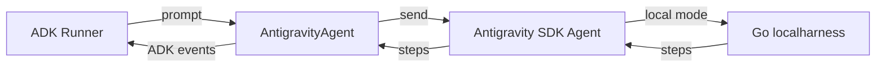

# Antigravity SDK Game Developer Agent

## Overview

This sample wraps a pre-configured [Google Antigravity SDK](https://pypi.org/project/google-antigravity/)
agent as a native ADK agent using `AntigravityAgent`, configured as a
**game developer** that writes small, runnable browser games into the
`game_repo/` workspace as single self-contained HTML files. Each turn is
delegated to the Antigravity
runner, and its trajectory steps (model text, tool calls, and tool responses)
are streamed back as standard ADK events recorded in the session.

`AntigravityAgent` must be used as a **standalone root agent** (the SDK currently
only supports local mode). See the
[package README](../../../../src/google/adk/labs/antigravity/README.md)
for the full setup, limitations, and API details.

## Prerequisites

- Install the SDK: `pip install "google-adk[antigravity]"`
- Set a Gemini API key: `export GEMINI_API_KEY="your-api-key"`
  (required by the Antigravity SDK, which drives the model)

The agent writes generated games into a `game_repo/` directory and persists
conversation trajectories (for cross-turn resumption) into a `trajectories/`
directory, both next to `agent.py` and created automatically on import.

## Sample Inputs

- `Create a playable Snake game.`

  The agent writes a self-contained HTML implementation into `game_repo/` (e.g.
  `game_repo/snake.html`, with inline CSS and JavaScript) using the built-in
  `create_file` tool, then explains how to open it in a browser.

- `Create a 2-player turn-based Artillery game with adjustable angle and power.`

  The agent writes another self-contained HTML game (e.g.
  `game_repo/artillery.html`) with canvas rendering and projectile physics.

- `Create a Brick Breaker game.`

  The agent writes a self-contained HTML implementation (e.g.
  `game_repo/brick_breaker.html`) with a paddle, ball, and breakable bricks.

## Graph

Each turn, the wrapper delegates to the SDK agent's local Go harness and maps
the trajectory steps it streams back into ADK events:



## How To

The wrapper takes a `google.antigravity.LocalAgentConfig` via the `config`
argument:

```python
root_agent = AntigravityAgent(
    name="antigravity_game_developer",
    description="...",
    config=_sdk_config,
)
```

The SDK agent enables its built-in file tools by default; the
`policy.workspace_only([...])` policy keeps all file reads and writes contained
to `game_repo/`. Internally, `AntigravityAgent._run_async_impl` deep-copies the
config per turn (the SDK's `AsyncExitStack` is single-use), enters a fresh SDK
`Agent`, sends the latest user prompt, and converts each streamed Step into ADK
events.

The root-only restriction is enforced at construction time: giving the agent
`sub_agents`, or adopting it under a parent agent, raises a `ValueError`.
