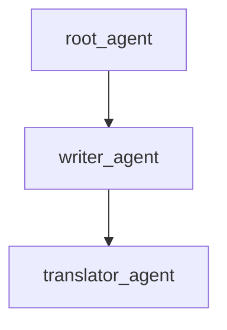

# Three Layer Transfer Sample

## Overview

This sample demonstrates a three-layer multi-agent system built with the ADK Python toolkit, showcasing structured double-round-trip hierarchical transfers.

## Sample Inputs

- `Hello, who are you?`
- `Can you write a short story about a lost kitten?`
- `Please translate it into Spanish.`
- `Looks great! Let's return to the project coordinator.`

## Graph

## How To

This sample demonstrates:

1. Root delegating to middle-child node `writer_agent`.
1. `writer_agent` delegating to leaf-grandchild node `translator_agent`.
1. Grandchild returning back to the parent `writer_agent`.
1. Parent returning back to the root coordinator `root_agent`.
