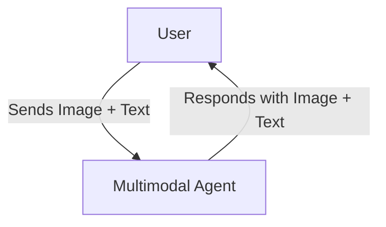

# Multimodal Agent

## Overview

This sample demonstrates a simple standalone agent that supports multimodal input and output. It uses the "nano banana model" (`gemini-2.5-flash-image`) that can understand and generate images directly.

## Sample Inputs

- `An image of a banana with the question: "Is this banana ripe?"`

- `A text prompt: "Generate a picture of a banana split."`

## Graph

Since this is a simple standalone agent without tools, the flow is a direct interaction between the user and the agent:

## How To

This sample demonstrates:

1. **Multimodal Input**: The agent can process both text and image parts in the conversation history.
1. **Multimodal Output**: The agent can generate images directly in its response.

To run this sample, ensure you have the necessary environment variables set for the Gemini client.
