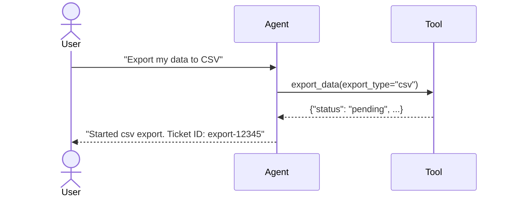

# Long Running Functions

## Overview

This sample demonstrates how to use `LongRunningFunctionTool` in ADK to handle operations that take a significant amount of time to complete.

When a tool is marked as long-running, the framework understands that the function may return a pending status and that the final result will be provided asynchronously. This is useful for tasks like starting a background job, requesting human approval, or any operation where the result is not immediately available.

## Sample Inputs

- `Export my data to CSV`

- `Start a JSON data export`

- `Export my data to both CSV and JSON simultaneously`

## Graph



## How To

To create a long-running function tool:

1. Define your Python function. It can return a status indicating it is in-progress (e.g., `{"status": "in-progress"}`).
1. Wrap the function using `LongRunningFunctionTool(func=your_function)`.
1. Pass the wrapped tool to the `Agent`.

After the initial in-progress response, you can send additional function responses (e.g., containing progress updates like `{"status": "in-progress", "progress": "50%"}`) to the agent. This will trigger another model turn, allowing the agent to report the current progress back to the user.

In the ADK Web UI, you can send an additional response by hovering over the function response button and selecting 'Send another response' from the menu.

```python
from google.adk import Agent
from google.adk.tools.long_running_tool import LongRunningFunctionTool
def export_data(export_type: str) -> dict[str, str]:
  # Start async task...
  return {
      "status": "in-progress",
      "progress": "0%",
      "message": f"Exporting {export_type} data. This may take some time.",
  }


agent = Agent(
    name="my_agent",
    model="gemini-2.5-flash",
    tools=[LongRunningFunctionTool(func=export_data)],
)
```
