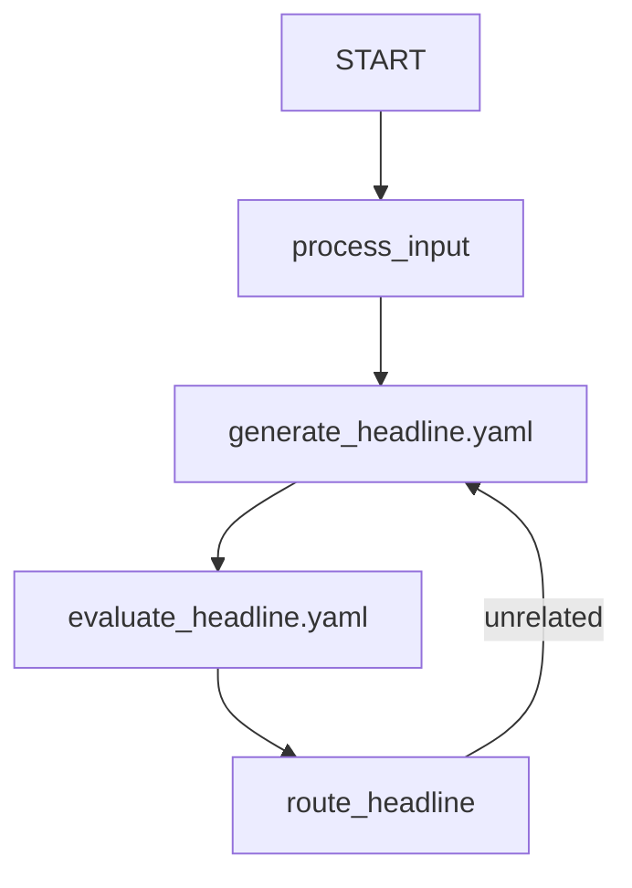

# Workflow Loop Config Sample

## Overview

This sample demonstrates how to define a workflow with a feedback loop using a YAML configuration file. It mirrors the `workflow_samples/loop` sample, but uses YAML to define the workflow structure instead of Python.

## Sample Inputs

- `Python programming`

- `Baking cookies`

## Graph

## How To

This sample uses some special syntax in `root_agent.yaml` to support dynamic resolution and graph construction:

### 1. `_code` Suffix

Fields ending with `_code` (like `output_schema_code` in `evaluate_headline.yaml`) tell the ADK YAML mapper to resolve the value as a Python code reference rather than treating it as a plain string.

- If it starts with `.`, it resolves relative to the current agent directory's Python package path.
- Example: `output_schema_code: .agent.Feedback` resolves to the `Feedback` Pydantic model in `agent.py` in the same directory.

### 2. Function References in Edges

If a string in the edge list does not end with `.yaml` and is not `'START'`, it is treated as a function reference.

- If it starts with `.`, it resolves relative to the current agent directory's Python package path.
- Example: `.agent.process_input` resolves to the `process_input` function in `agent.py`.
- It automatically creates a `FunctionNode` with the function's name as the node name.

### 3. External Agent Files

Agents can be defined in their own YAML files and referenced by filename in the edges list.

- Example: `generate_headline.yaml` references the agent defined in that file.
- The mapper caches resolved nodes by their string value, so using the same filename in multiple edges correctly reuses the same agent instance, preserving the graph structure (e.g. for loops).
