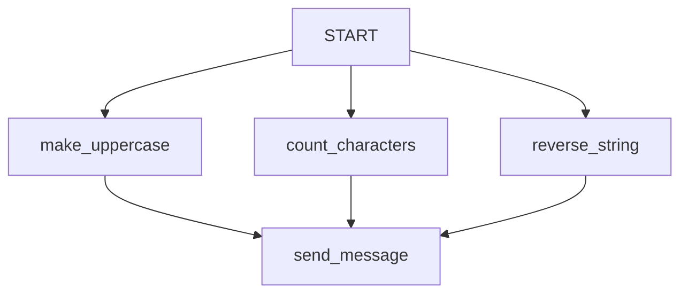

# ADK Workflow Multi-Triggers Sample

## Overview

This sample demonstrates how a single node can fan out to execute multiple downstream nodes concurrently, and how multiple upstream nodes can trigger a single downstream node independently in **ADK Workflows**.

In this example, the `START` node fans out to three different processing functions (`make_uppercase`, `count_characters`, and `reverse_string`). Each of these functions receives the initial user input string, processes it, and then independently outputs its result.

Because the subsequent `send_message` node receives a continuous flow of outputs and does not use an aggregation mechanism (like `JoinNode`), it is triggered multiple times—once for every upstream event.

## Sample Inputs

- `Hello World`

- `ADK workflows`

- `testing concurrent nodes`

## Graph



## How To

1. You can specify a tuple of nodes within an edge to create a parallel fan-out segment where the same input is provided to multiple nodes:

   ```python
   (
       "START",
       (make_uppercase, count_characters, reverse_string),
       # ...
   )
   ```

1. By continuing the sequence to another node after the tuple, the outputs of all nodes in the tuple will independently trigger that target node:

   ```python
   (
       "START",
       (make_uppercase, count_characters, reverse_string),
       send_message,
   )
   ```

   In this case, `send_message` will be executed once for `make_uppercase`'s output, once for `count_characters`'s output, and once for `reverse_string`'s output.
