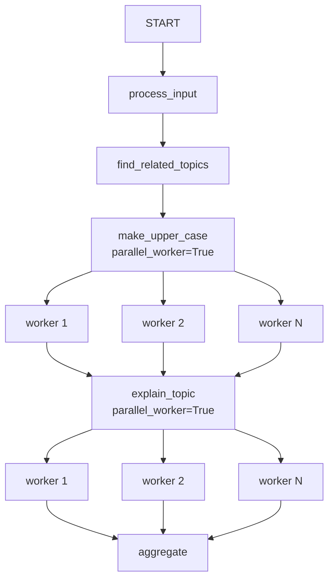

# ADK Workflow Parallel Worker Sample

## Overview

This sample demonstrates how to use **parallel workers** in ADK Workflows.

It takes a user-provided topic, uses an agent to find a list of related topics. The workflow engine will automatically fan-out execution across multiple concurrently running nodes when given an iterable of inputs. First, it dynamically spins up multiple instances of the `make_upper_case` function in parallel to capitalize the topics. Then, it dynamically spins up parallel instances of the `explain_topic` agent to explain each related topic concurrently. Finally, an `aggregate` function collects and formats all the parallel explanations into a single response.

## Sample Inputs

- `machine learning`

- `renewable energy`

- `space exploration`

## Graph



## How To

Both agents and functions can be designed as parallel workers in an ADK Workflow.

1. Ensure the preceding node in the workflow outputs an iterable (e.g., a `list`). The workflow engine will automatically fan-out and execute the parallel worker node concurrently for each item in the iterable.

1. To define an **Agent** as a parallel worker, use the `parallel_worker=True` parameter:

   ```python
   explain_topic = Agent(
       name="explain_topic",
       instruction="""Explain how the following topic relates to the original topic: "{topic}".""",
       parallel_worker=True,
       output_schema=TopicExplanation,
   )
   ```

1. To define a **Python function** as a parallel worker, decorate it with `@node(parallel_worker=True)`:

   ```python
   from google.adk.workflow import node

   @node(parallel_worker=True)
   def make_upper_case(node_input: str):
     yield node_input.upper()
   ```

1. The subsequent node in the workflow will receive the results from all parallel executions as a single aggregated list (e.g., `list[TopicExplanation]`).
